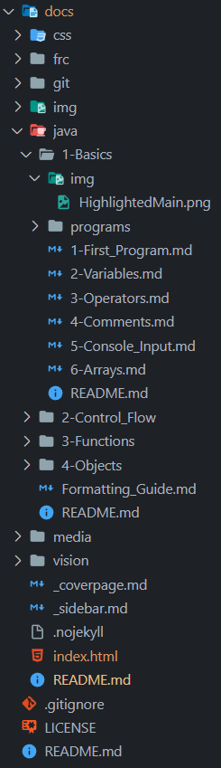
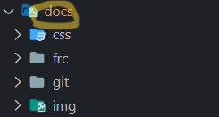
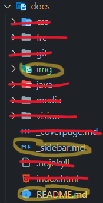
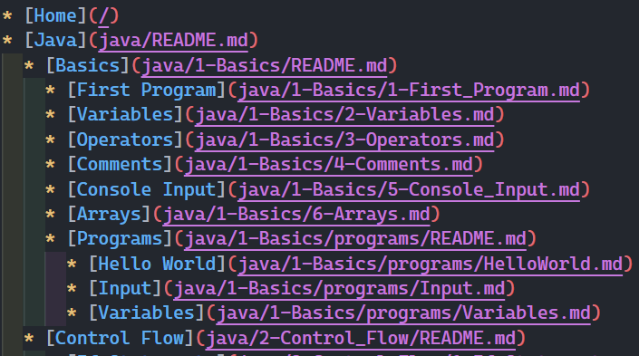
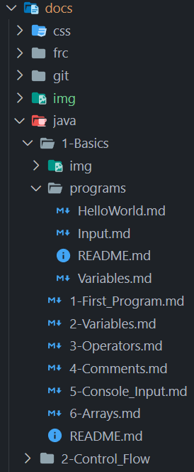
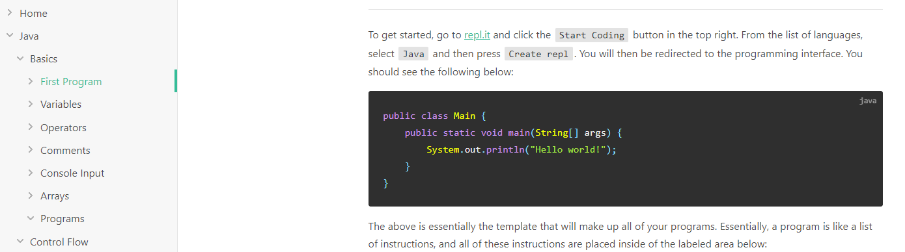

# Documentation Guide

## Before you start

You will need a [GitHub](https://github.com/) account.

You are highly encouraged to do the following:

- Use a personal computer/laptop
- Download [VSCode](https://code.visualstudio.com/)
- Download [GitHub Desktop](https://desktop.github.com/) (make sure it installs Git Bash as well)

### Why use your own device?

Besides the fact that Chromebooks are dreadfully slow, it's **so** much easier previewing your work. It is also rather difficult previewing how images look on Chromebooks.

### Sidenote: editing directly on GitHub

Click `Add File`. Note that empty folders are not allowed. If you need to create a folder, name the file `foldername/README.md`. This will force GitHub to create a folder with a `README.md` file within it. You don't need to name the file `README.md`, but more on that later.

## Preface

This website's formatting depends on the particular folder structure and files it is expected to interpret.
To format our files, we use [Markdown](https://www.markdownguide.org/).

Why should we use this? Well, unlike Word or Google Docs, formatting is directly added to the text file you write in, so you'll never have to worry about weird formatting changes between copying formatted text from one file to another; in other words, it's always _consistent_.

## Basic Markdown

Let's start learning some basic Markdown syntax (don't worry, it's super simple!).

- If you're in VSCode, create a new file ending in `.md`. Preview your work with `Ctrl + Shift + V`.
- If you're on a Chromebook, go to [this](https://markdownlivepreview.com/) website.

**[This](https://www.markdownguide.org/cheat-sheet/#basic-syntax) cheat sheet has 99% of all the Markdown you need to know.**

Try out each of the elements! Notice how what you write becomes nicely formatted when your Markdown gets parsed.

For example, the section you're reading **right now** was written like this:

```md
## Basic Markdown

Let's start learning some basic Markdown syntax (don't worry, it's super simple!).

- If you're in VSCode, create a new file ending in `.md`.
- If you're on a Chromebook, go to [this](https://markdownlivepreview.com/) website.

[This](https://www.markdownguide.org/cheat-sheet/#basic-syntax) cheat sheet 99% of all the Markdown you need to know.

Try out each of the elements! Notice how what you write becomes nicely formatted when your Markdown gets parsed.

For example, the section you're reading **right now** was written like this:
```

> [!TIP]
> Number each item in an ordered list with `1.`, and Markdown will automatically figure out the numbering for you.

> [!NOTE]
> It's good practice to leave a blank line between a heading and the text below it. Personally, as a rule of thumb, I seperate different elements (e.g., heading & text, list & text, video & text) with a blank line.

### Basic Mistakes

To put a sentence on a new line, leave a blank line between the two sentences.

Otherwise, if this is your Markdown:

```
This sentence should be
on two lines.
```

It'll show up like this:

```
This sentence should be on two lines.
```

Instead, leave a blank line:

```
This sentence should be

on two lines.
```

## Fancy Markdown

Here's some fancy stuff our website can do, as well as some stuff you might find useful.

### Callouts

These are great ways to draw attention to your documentation! A callout has the following syntax:

```md
> [!CALLOUT_TYPE]
> Sample text.
```

There are four default callout types: `NOTE`, `TIP`, `WARNING`, `ATTENTION`.

They look like this:

> [!NOTE]
> An alert of type 'note' using global style 'callout'.

> [!TIP]
> An alert of type 'tip' using global style 'callout'.

> [!WARNING]
> An alert of type 'warning' using global style 'callout'.

> [!ATTENTION]
> An alert of type 'attention' using global style 'callout'.

If you would like to create custom callouts, follow the guide [here](https://github.com/fzankl/docsify-plugin-flexible-alerts/blob/main/README.md).

### Presentation Embeddings

Copy the following code, replacing everything in brackets.

- *You can also copy the entire embed code Slides gives you by going to `File > Share > Publish to web` but I personally don't like its default settings.*

```html
<iframe src="<slides embed link>" frameborder="0" width="<width>" height="<height>" allowfullscreen="true" mozallowfullscreen="true" webkitallowfullscreen="true"></iframe>
```

For example, this code

```html
<iframe src="https://docs.google.com/presentation/d/e/2PACX-1vSVQb1zfvkKVTH10OOZ76JOG49clUGdtJ4lggAwKyy6wUGJkcD1Qj6NqyMKi1EvCDwnq9S2bvHgZsZW/embed" frameborder="0" width="760" height="569" allowfullscreen="true" mozallowfullscreen="true" webkitallowfullscreen="true"></iframe>
```

turns out like this:

<iframe src="https://docs.google.com/presentation/d/e/2PACX-1vSVQb1zfvkKVTH10OOZ76JOG49clUGdtJ4lggAwKyy6wUGJkcD1Qj6NqyMKi1EvCDwnq9S2bvHgZsZW/embed" frameborder="0" width="760" height="569" allowfullscreen="true" mozallowfullscreen="true" webkitallowfullscreen="true"></iframe>

#### Getting `<slides embed link>`

In your presentation, go to `File > Share > Publish to web` and copy the link. 

The link will look something like this:

<em>ht<span>tps://</span>docs.google.com/presentation/d/e/2PACX-1vSVQb1zfvkKVTH10OOZ76JOG49clUGdtJ4lggAwKyy6wUGJkcD1Qj6NqyMKi1EvCDwnq9S2bvHgZsZW/pub?<strong>start=false&loop=false&delayms=3000</strong></em>

Get rid of everything after `pub?`:

<em>ht<span>tps://</span>docs.google.com/presentation/d/e/2PACX-1vSVQb1zfvkKVTH10OOZ76JOG49clUGdtJ4lggAwKyy6wUGJkcD1Qj6NqyMKi1EvCDwnq9S2bvHgZsZW/<strong>pub?</strong></em>

Replace `pub?` with `embed`:

<em>ht<span>tps://</span>docs.google.com/presentation/d/e/2PACX-1vSVQb1zfvkKVTH10OOZ76JOG49clUGdtJ4lggAwKyy6wUGJkcD1Qj6NqyMKi1EvCDwnq9S2bvHgZsZW/<strong>embed</strong></em>

This is your `<slides embed link>`.

### Video Embeddings

Copy the following code, replacing everything in brackets.

- *Again, you can also copy the entire embed code YouTube gives you by going to `Share > Embed` but I personally don't like its default settings.*

```html
<iframe width="<width>" height="<height>" src="<YouTube link>" title="YouTube video player" frameborder="0" allow="accelerometer; autoplay; clipboard-write; encrypted-media; gyroscope; picture-in-picture; web-share" allowfullscreen></iframe>
```

For example, this code

```html
<iframe width="560" height="315" src="https://www.youtube.com/embed/O-Ys8Ash1J4" title="YouTube video player" frameborder="0" allow="accelerometer; autoplay; clipboard-write; encrypted-media; gyroscope; picture-in-picture; web-share" allowfullscreen></iframe>
```

turns out like this:

<iframe width="560" height="315" src="https://www.youtube.com/embed/O-Ys8Ash1J4" title="YouTube video player" frameborder="0" allow="accelerometer; autoplay; clipboard-write; encrypted-media; gyroscope; picture-in-picture; web-share" allowfullscreen></iframe>

#### Getting `<YouTube link>`

On the YouTube video, go to `Share` and copy the link.

The link will look something like this:

<em>ht<span>tps://</span>youtu.be/O-Ys8Ash1J4<strong>?si=4QrApbmLEXJafLFm</strong></em>

Get rid of everything after `?`:

<em>ht<span>tps://</span>youtu.be/O-Ys8Ash1J4</em>

This is your `<slides embed link>`.

## Folder structure

Right now, the folder structure looks like this:



Don't be alarmed! Most of you see is programming's documentation and can be ignored. Let's break it down step by step.

### The `docs` folder

This is where all our documentation files and folders will go.



As it turns out, we can ignore most of the files and folders within it; there are only 3 we need to focus on. Let's go through them.



#### The `README.md` file

This file should always be the landing page of any folder (more on that when we talk about `_sidebar.md`).

#### The `img/` folder

As is good practice, we isolate our images into a separate `img/` folder. Thus when embedding them, we must do:

```md

```

### The `_sidebar.md` file and folder setup

Since this website was ported from the programming documentation, this sidebar may look unseemly:



Before we panic, let's take a moment to look at the folder structure again.



Let's compare it to the actual programming documentation [website](https://frc1257.github.io/robotics-training/#/java/1-Basics/1-First_Program).



Don't you notice something? Here's what I notice:

1. `_sidebar.md` directly links tabs in the sidebar to actual Markdown files
1. `_sidebar.md` has **identation** that directly mirrors the folder structure
1. Folders (e.g., `java/`, `1-Basics/`, `programs/`) help us divide our documentation into easily browsable sections

> [!NOTE]
> `[Home]` is the page you're looking at right now. The website implicitly knows to display `docs/README.md` as the homepage.

### Recap

1. To create a new section, create a folder within `docs/`
1. To create a subsection, just create a folder within the one you already created
1. Be sure to create a `README.md` in each folder that introduces the topic of the section
1. Be sure to update `_sidebar.md` as you add or remove folders/sections and files
1. To follow best practice when storing images, create a `img/` folder within each section to store them

## 🎉 Conclusion

Congrats! You've just figured out the entire folder structure just by looking at 3 images! And in fact, this is **everything** that you need to know to make awesome documentation. Happy documenting!


