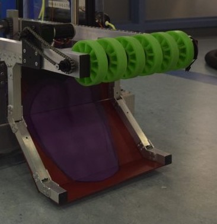

# First Subsystem (Roller Intake)

Now that we have gone over what the command-based paradigm is and what actuators are, we can now try programming our first subsystem!

## Overview

A subsystem is any major mechanism on our robot that achieves a task, whether it be moving the robot to a desired position, or picking up and scoring game pieces. In code, a subsystem is represented by its **actuators** and **sensors**. We will cover sensors later and focus on actuators now.

To manage our subsystem, we have to determine what its possible "states" are. In other words, we must find the possible configurations/modes a subsystem can be set to. You can think of a "state" as sort of an "operating mode." Our subsystem could be in different operating modes and swap through them as certain buttons are pressed. We will go over an example of this below when we discuss the states of our roller intake. Figuring out what the different states are is a crucial part of learning to design a robot subsystem in code.

Once we have this state stored in our code, every time we want to update our subsystem and send commands to its respective actuators, we will check what our state is and call the appropriate action: this design idea is known as a `state machine`. For example, if a state is telling us that our subsystem should be ejecting, we will set the motors to spin outwards.

Now that we have an idea of how subsystems are structured in code, let's look at one of the simplest: a roller intake.

## Roller Intake Description



Pictured above is the intake from 1257's robot for 2019's Destination: Deep Space. The green wheels are connected to a single motor and motor controller combination. That motor can spin inwards to take in cargo balls, and then eject the balls by spinning outward. While the ball is *within* the intake, we will keep it in place by spinning the wheels at a small, neutral speed.

For this tutorial, we'll assume that a SPARK MAX motor controller was used to control our motor.

## Flowchart

Before we get into going over the code, we're going to review a flowchart of our code and generally how the subsystem will fit into the command-based model. Make sure you zoom in to see the details. If the flowchart does not load, please [press here](https://drive.google.com/file/d/1OdYeyfamvG7weoWkQY1DDX4__NVKelgm/view?usp=sharing) to view a copy of it.

The green sections will be handled by our subsystem class, while the red sections will be handled by the `RobotContainer` file.

<iframe frameborder="0" style="width:100%;height:343px;" src="https://app.diagrams.net/?lightbox=1&highlight=0000ff&edit=_blank&layers=1&nav=1&title=Roller%20Intake%20Flowchart.drawio#Uhttps%3A%2F%2Fdrive.google.com%2Fuc%3Fid%3D1OdYeyfamvG7weoWkQY1DDX4__NVKelgm%26export%3Ddownload"></iframe>

Now that we have the basics out of the way, it's time to start coding!

## Snail Subsystem

Before we make our file that represents the subsystem in code, there is one file in our template which is essential: `SnailSubsystem.java`. This file is an abstract class that each subsystem class must extend to be recognized as a subsystem in our code. For a refresh on what abstract classes are and their uses, go to our [Polymorphism page](https://github.com/FRC1257/robotics-training/blob/Ethan-Subsystem/java/4.%20Objects/6.%20Polymorphism.md).

Here is a copy of the `SnailSubsystem` code:

```java

package frc.robot.subsystems;

import edu.wpi.first.wpilibj2.command.SubsystemBase;

public abstract class SnailSubsystem extends SubsystemBase {

    public abstract void update();
    public abstract void displayShuffleboard();
    public abstract void tuningInit();
    public abstract void tuningPeriodic();
}
```

All four of the functions listed in the class are **abstract**, or have to be implemented by any custom subsystems that we create as part of our robot. We will only focus on the first one in this section, although we will cover all of them in the future.

- `update()` - called every 10 milliseconds to update the state of the motors in our subsystem
- `displayShuffleboard()` - called every 20 milliseconds to send data to the driver dashboard
- `tuningInit()` - called at the beginning of running the robot in test mode to set up tuning constants
- `tuningPeriodic()` called every 20 milliseconds during test mode to update tuning constants

## Programming

We will start with the basic skeleton for our subsystem:

```java
package frc.robot.subsystems;

import com.revrobotics.CANSparkMax;
import com.revrobotics.CANSparkMax.IdleMode;
import com.revrobotics.CANSparkMaxLowLevel.MotorType;

public class RollerIntake extends SnailSubsystem {

    public enum State {

    }

    public RollerIntake() {

    }

    @Override
    public void update() {

    }

    @Override
    public void displayShuffleboard() {

    }

    @Override
    public void tuningInit() {

    }

    @Override
    public void tuningPeriodic() {

    }

    public State getState() {
        return state;
    }
}
```

The first part of the code is basic setup that imports a bunch of necessary lines for controlling `SPARK MAX` motors, and then creates the class that will hold the rest of our code for the subsystem. We will go over some of the crucial details of this, although most of what we have so far is just creating function outlines that we can fill in later.

### enum State

The first chunk of code is when an enum called `State` is declared. If you need a refresher on enums, go to our [enums page](https://github.com/FRC1257/robotics-training/blob/Ethan-Subsystem/java/2.%20Control-Flow/7.%20Enums.md). This enum is essentially a custom data structures that could be any of the **possible** states that our subsystem could be in.

### RollerIntake()

This is the constructor for the subsystem, where things like motor controllers, their settings, sensors, and extra variables are defined here.

### update()

This function is responsible for making the robot do things based off of the subsystem's current state. For example, this function could make a motor spin inwards to suck a ball into the robot if the state variable were set to the value `INTAKING`. This function is run by the robot 100 times per second at the moment during a match, so it is very responsive.

### getState()

This function is very self-explanatory; it simply returns the state of the robot. That can be very useful when the state needs to be accessed from another file.

### Other Functions

We will go over other functions related to extra functionality, such as outputting data, another time. For now, we **must** define them, but we can just leave them blank.

## Adding Functionality

Now that we have the skeleton of the subsystem out of the way, we can start programming the subsystem.

### Declaring The Motor Controllers

```java

package frc.robot.subsystems;

import com.revrobotics.CANSparkMax;
import com.revrobotics.CANSparkMax.IdleMode;
import com.revrobotics.CANSparkMaxLowLevel.MotorType;

public class RollerIntake extends SnailSubsystem {

    private CANSparkMax rollerIntakeMotor;

    ...
}
```

The first thing that is usually done when making a subsystem is the declaration of the necessary motor controllers that are a part of this subsystem. In this subsystem, we only have one `CANSparkMax`, as described in the beginning. After this declaration, the rest of the code can define and use the motor controller.

### Making The States

```java
...

public class RollerIntake extends SnailSubsystem {

    private CANSparkMax rollerIntakeMotor;

    public enum State {
        INTAKING,
        EJECTING,
        NEUTRAL
    }

    State state = State.NEUTRAL;

    ...
```

Next, the states of the subsystem should be thought of and declared in the top enum. For our intake, there are three main "operating modes" that it can be in: ejecting a game piece, intaking a game piece, or running at a neutral speed. These correspond with what we call `states` of the subsystem, which is what we are representing with the enum. 

The three states declared are `INTAKING`, `EJECTING`, and `NEUTRAL`. Each of them represents a different operation the robot would have to perform. Our enum will define that all of these possible states can exist, and then the actual `state` variable below holds which current state we are in. It is going to have a default value of `NEUTRAL`, and this makes logical sense as when the robot just turns on it should not be moving until given the command.

### Making The Constructor

```java

 public RollerIntake() {
        rollerIntakeMotor = new CANSparkMax(2, MotorType.kBrushless);
        rollerIntakeMotor.restoreFactoryDefaults();
        rollerIntakeMotor.setIdleMode(IdleMode.kBrake);
        rollerIntakeMotor.setSmartCurrentLimit(25); // in amps
    }
    ...
```

After declaring the states that the motor would be in, the motor controller is defined and its numerous settings are configured. All of these lines are written with the format of `rollerIntakeController.function()`, signifying that these are functions that belong to the motor controller object that we created in the very beginning.

1. When declaring a SPARK MAX motor controller, there are two parameters: The motor ID (which should be set to a constant that we will define and review later) and the motor type. Since in this case we are using NEO brushless motors, we will use `kBrushless` for the type.

2. `restoreFactoryDefaults()` wipes all settings on the motor controller to its defaults, ensuring that we know exactly what they are and that we can safely change what we want.

3. The next line sets the idle mode of our motor to **brake** mode, which essentially means that the motor will try to stop itself from moving when we give it a command of `0`.

4. Lastly, we set the current limit. If a motor experiences too much current for a sustained period of time it could get seriously damaged. This line of code is absolutely necessary to prevent that risk. The value of this current limit depends on the type of motor we are using. In this case, we are using a NEO 550 motor which is a smaller variant of the NEO motor and needs a relatively low current limit to prevent damage.

For the flowchart, this section corresponds to the first step: "Create the roller intake subsystem with all of its motors."

### Update Function

```java

   @Override
    public void update() {
        switch(state) {
            case NEUTRAL:
                rollerIntakeMotor.set(0.0);
                break;
            case INTAKING:
                rollerIntakeMotor.set(1.0);
                break;
            case EJECTING:
                rollerIntakeMotor.set(-1.0);
                break;
        }
    }
    ...
```

Once both the states and the motor controllers are declared, we can create the `update()` function. Its main purpose is to look at the current state via the `state` variable and run the corresponding action. To determine the task based off the state, a `switch()` statement is used in conjunction with the enum. For a roller intake, the motor's speed is set to the appropriate values according to the state.

With the flowchart, this section corresponds to the entire right green section, where we check the state and set the according motor speed.

### Making Methods To Trigger State Changes

```java

    public void neutral() {
        state = State.NEUTRAL;
    }

    public void eject() {
        state = State.EJECTING;
    }

    public void intake() {
        state = State.INTAKING;
    }
}
```

We are almost done with our subsystem file! The last thing we have to do is to make sure we have functions to change the subsystem's `state`. As shown above, we'll define three functions that have said purpose.

For instance, if our subsystem is at the `NEUTRAL` state and is running idly, and then we call `rollerIntake.intake()`, the subsystem will transition into the `INTAKING` state. The subsystem will continue to remain in that state until the state is changed again.

You may ask, what's the point of keeping the `state` variable private and go through all of this trouble to make 3 whole functions to set it? This is a practice in programming known as *[encapsulation](https://www.geeksforgeeks.org/encapsulation-in-java/)*, where, in this case, we "hide" the `state` variable from direct modification. We can manipulate the state variable when needed by calling these setter methods.

Encapsulation is useful because it prevents the `state` from being set improperly to a value such as `null`, or, when we get into more advanced mechanism control, prevents the state from getting changed without the other requirements being met.

<hr>

Below is all the code completed during this lesson. This would make up a fully functional, roller intake subsystem file.

```java
package frc.robot.subsystems;

import com.revrobotics.CANSparkMax;
import com.revrobotics.CANSparkMax.IdleMode;
import com.revrobotics.CANSparkMaxLowLevel.MotorType;

public class RollerIntake extends SnailSubsystem {

    private CANSparkMax rollerIntakeMotor;

    public enum State {
        INTAKING,
        EJECTING,
        NEUTRAL
    }

    State state = State.NEUTRAL;

    public RollerIntake() {
        rollerIntakeMotor = new CANSparkMax(2, MotorType.kBrushless);
        rollerIntakeMotor.restoreFactoryDefaults();
        rollerIntakeMotor.setIdleMode(IdleMode.kBrake);
        rollerIntakeMotor.setSmartCurrentLimit(25);
    }

    @Override
    public void update() {
        switch(state) {
            case NEUTRAL:
                rollerIntakeMotor.set(0.0);
                break;
            case INTAKING:
                rollerIntakeMotor.set(1.0);
                break;
            case EJECTING:
                rollerIntakeMotor.set(-1.0);
                break;
        }
    }

    public void neutral() {
        state = State.NEUTRAL;
    }

    public void eject() {
        state = State.EJECTING;
    }

    public void intake() {
        state = State.INTAKING;
    }

    @Override
    public void displayShuffleboard() {

    }

    @Override
    public void tuningInit() {

    }

    @Override
    public void tuningPeriodic() {

    }

    public State getState() {
        return state;
    }
}
```

## Conclusion

Now that you have a basic feel for a subsystem, we will be exploring how to make constants in our next lesson. If you have any questions or concerns about this lesson, feel free to ask a senior programmer.
