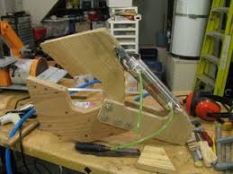
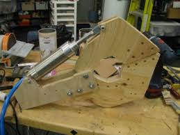

# Claw Intake

Now that you know how to make a subystem and its supporting files we are going to cover making other subsystems with different features and purposes. The next few lessons will be about learning each of the major subsystems that 1257 uses, why they are important and how we can program them.

## Subsystem Overview

 

Above is a basic claw-like structure that may be encountered. This claw has only one cylinder controlled by a solenoid to open and close it. In this specific claw, when the cylinder extends, the claw closes. There are many other types of claws that may be used. For example, there may be a claw with pistons on both sides like team 1257's 2018 robot.

### Purpose

Claws are used to grab balls, cubes, or other game objects. The claw may consist of only one piston or it can consists of two pistons that close and open the claw from both sides. Claws can also be run by motors though they are not often used due to a power deficiency.

### Why Pneumatics?

The reason team 1257 uses pneumatics is because pneumatics are relatively cheap while also being very strong. A claw needs to reliably hold the balls, cubes, or any other game pieces, so a pneumatic claw seems like the obvious choice. An example of this usage of a claw was in team 1257's 2018 robot where it was modified with pneumatics to hold cubes well without dropping them.

## Subsystem File

### Declaring Solenoids

```java 
package frc.robot.subsystems;
import edu.wpi.first.wpilibj.DoubleSolenoid;
import edu.wpi.first.wpilibj.DoubleSolenoid.Value;

import static frc.robot.Constants.ElectricalLayout.*;
import static frc.robot.Constants.Claw.*;

public class Claw extends SnailSubsystem {

    private DoubleSolenoid rightSolenoid;
    private DoubleSolenoid leftSolenoid;
```

First, the solenoids are declared. Since this subsystem uses pneumatics (air) instead of motors, solenoids replace motor controllers in the code. The solenoids are responsible for determining if air goes to the pneumatic cylinders or not. Since the claw we are making has a pneumatic cylinder on each side, there are two solenoids declared. Each of the solenoids is a part of the class `DoubleSolenoid` which means that the solenoids can hold two positions, forward and reverse. Each of these corresponds to the claw being either open or closed. 

Note: A different class would be used for a single-acting solenoid, which can apply force to one direction, but not the other. 

### States

```java
    public enum State {
       CLOSED,
       OPEN
    }

    State state = State.OPEN;
```

After declaring the solenoids, the states are declared. For the claw subsystem, there are only two states: `CLOSED` and `OPEN`. Closed represents when the claw shuts around the object and open is when the claw is opened so it is not capable of holding a block. 

Usually, the cylinders are extended when the claw is closed and not extended when the claw is open.

After the states are declared, a state variable is set to `OPEN` as that will be the default state of the subsystem.

### Constructor

```java
    public Claw() {
        leftSolenoid = new DoubleSolenoid(CLAW_LEFT_FORWARD_ID, CLAW_LEFT_REVERSE_ID);
        rightSolenoid = new DoubleSolenoid(CLAW_RIGHT_FORWARD_ID, CLAW_RIGHT_REVERSE_ID);
    }
```

The constructor is very straightforward. Each of the solenoid objects is defined. In the parameters, there are two IDs representing the forward and reverse direction for each pneumatic cylinder. The reason there are two IDs is because air needs to be pumped from a different tube for each direction the double-acting solenoid makes the piston in the cylinder go in.

### Update Function

```java
    @Override
    public void update() {
        switch(state) {
            case CLOSED:
                leftSolenoid.set(Value.kForward);
                rightSolenoid.set(Value.kForward);
                break;
            case OPEN:
                leftSolenoid.set(Value.kReverse);
                rightSolenoid.set(Value.kReverse);
                break;
        }
    }
```

Once each of the solenoids is defined and the states are declared, the update function is made in order to define what happens during each state. In the `CLOSED` state the pneumatic cylinders extend as the solenoids are set to `Value.kForward`. In the `OPEN` state, the pneumatic cylinders retract as the solenoids are set to `Value.kReverse`.

### ShuffleBoard Functions

```java
    public void displayShuffleboard() {

    }

    public void tuningInit() {

    }

    public void tuningPeriodic() {

    }
```

These functions will be implemented in later posts.

### State Functions

```java
    public void open() {
        state = State.OPEN;
    }

    public void close() {
        state = State.CLOSED;
    }

    public State getState() {
        return state;
    }
}
```

The last thing that is done is the declaration of the functions which set the state to `OPEN` or `CLOSED` and the making of a function that returns the current state of the subsystem.

## Commands

### Close Command

```java
package frc.robot.commands.claw;

import edu.wpi.first.wpilibj2.command.CommandBase;
import frc.robot.subsystems.Claw;

public class ClawCloseCommand extends CommandBase {

    private Claw claw;

    public ClawCloseCommand(Claw claw) {
        this.claw = claw;

        addRequirements(claw);
    }

    @Override
    public void initialize() {
    }

    @Override
    public void execute() {
        claw.close();
    }

    @Override
    public void end(boolean interrupted) {
        claw.open();
    }

    @Override
    public boolean isFinished() {
        return false;
    }
}
```

The commands in the claw subsystem work in the exact same way as the commands in the roller intake. Below is a brief description of what happens in the command for closing the claw.

1. A local claw object is declared.
2. In the constructor, the local object is set equal to a passed in claw and the requirements are added.
3. In the execute function, the state is set to `CLOSED` through the close function.
4. In the end function, the state is set to `OPEN` through the open function. The end function triggers when the command ends.
5. In isFinished(), it is defined that the command ends when the command is no longer being run by the scheduler.

### Open Command

The command for opening is the exact same as the command for closing except for the fact that claw.open() does not need to be called when the function ends as the state is already open. Nevertheless, the code for this command is included below.

```java
package frc.robot.commands.claw;

import edu.wpi.first.wpilibj2.command.CommandBase;
import frc.robot.subsystems.Claw;

public class ClawOpenCommand extends CommandBase {

    private Claw claw;

    public ClawOpenCommand(Claw claw) {
        this.claw = claw;

        addRequirements(claw);
    }

    @Override
    public void initialize() {
    }

    @Override
    public void execute() {
        claw.open();
    }

    @Override
    public void end(boolean interrupted) {
    }

    @Override
    public boolean isFinished() {
        return false;
    }
}
```

If the specific functions in the commands need more explanation, refer to the rollerIntake commands tutorial file.

## Robot Container(Bindings)

The bindings for a claw are extremely similar to the roller intake bindings. If more information is needed about how bindings work, please go to the roller intake bindings tutorial.

### Variable Declarations

```java
package frc.robot;

import edu.wpi.first.wpilibj.Notifier;
import edu.wpi.first.wpilibj.XboxController.Button;
import edu.wpi.first.wpilibj.smartdashboard.SmartDashboard;
import edu.wpi.first.wpilibj2.command.Command;
import frc.robot.subsystems.SnailSubsystem;
import frc.robot.util.SnailController;
import frc.robot.subsystems.Claw;


import frc.robot.commands.claw.ClawCloseCommand;
import frc.robot.commands.claw.ClawOpenCommand;
import java.util.ArrayList;

import static frc.robot.Constants.ElectricalLayout.CONTROLLER_DRIVER_ID;
import static frc.robot.Constants.ElectricalLayout.CONTROLLER_OPERATOR_ID;
import static frc.robot.Constants.UPDATE_PERIOD;

public class RobotContainer {

    private SnailController driveController;
    private SnailController operatorController;

    private Claw claw;

    private ArrayList<SnailSubsystem> subsystems;
```

After the neccesary imports are made, the objects are declared. The two Xbox controllers, the subsystems, and an ArrayList for storing the subsystems are declared.

### Constructor and the Bindings

```java
    public RobotContainer() {
        driveController = new SnailController(CONTROLLER_DRIVER_ID);
        operatorController = new SnailController(CONTROLLER_OPERATOR_ID);

        configureSubsystems();
        configureButtonBindings();
    }

    private void configureSubsystems() {
        claw = new Claw();
        claw.setDefaultCommand(new ClawOpenCommand(claw));

        subsystems = new ArrayList<>();
        subsystems.add(claw);
    }

    private void configureButtonBindings() {
        operatorController.getButton(Button.kX.value).whileActiveOnce(new ClawCloseCommand(claw));
    }
}
```

In the constructor there are a few things done:

1. The two controllers are defined with their ID is a parameter.

2. The configureSubsystems() is called. The subsystems are defined, the default commands are defined, and then the subsystems added to an ArrayList. The reason an ArrayList is used is so the subsystems can be updated more efficiently later on in the code.

3. Lastly, configureButtonBindings() is called. Since `ClawOpenCommand` is the default command, there is no button binding for it. There is only one binding for `ClawCloseCommand`. WhileActiveOnce means that the close command runs if and only if the respective button is being pressed.

## Constants

Below is the constants file which is self-explanatory and has been reviewed in the roller intake subsystem tutorial. Refer to that if you need a refresher.

```java
package frc.robot;
public final class Constants {

    public static class ElectricalLayout {
        public final static int CONTROLLER_DRIVER_ID = 0;
        public final static int CONTROLLER_OPERATOR_ID = 1;
        public final static int CLAW_LEFT_FORWARD_ID = 0;
        public final static int CLAW_LEFT_REVERSE_ID = 1;
        public final static int CLAW_RIGHT_FORWARD_ID = 2;
        public final static int CLAW_RIGHT_REVERSE_ID = 3;
    }

    public static class Autonomous {
        //nothing
    }

    public static class Claw {
        //nothing here for now
    }

    public static double PI = 3.14159265;
    public static double UPDATE_PERIOD = 0.010;

}
```

## Final Remarks

If there are any lingering questions about anything gone over in this lesson, please contact a senior programming member.

With the claw lesson over, you now know how to code two major subsystems that team 1257 uses! Next lesson, we will learn about yet another subsystem that team 1257 uses nearly every year: the arm!
