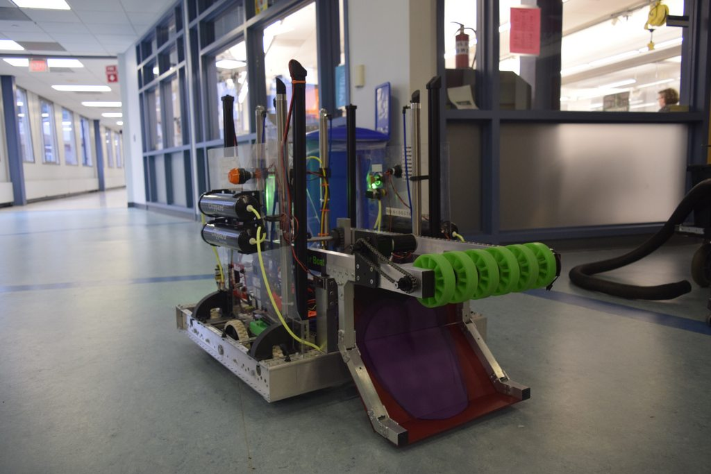

# Arm

Now that you know how to make a claw and a roller intake, it is time to learn about a subsystem usually made in conjunction with the two. In this lesson the purpose of the subsystem and the basic code to make it run will be gone over.
## Subsystem Overview



Above is a picture of the entire robot as in order to understand what an arm truly is, the surrounding susbsystems are needed. Attached to the roller intake(the shovel like subsystem) are two bars. The bars are considered the arm of the robot and they are controlled by a motor and its motorcontoller on the other side. This allows the arm to bring the roller intake up or down.

### Purpose

The purpose of the arm is generally to make a part or susbsytem of the robot able to move up or down. Above it was shown how the roller intake was able to move up and down though of course any other subsystem could have been used. The ability to move up and down allowed team 1257's 2019 robot to put balls at different heights.

## Subsystem File

### Declaring Motor Controllers
```java
package frc.robot.subsystems;

import com.revrobotics.CANSparkMax;
import com.revrobotics.CANSparkMax.IdleMode;
import com.revrobotics.CANSparkMaxLowLevel.MotorType;

import static frc.robot.Constants.ElectricalLayout.*;
import static frc.robot.Constants.Arm.*;
import static frc.robot.Constants.NEO_550_CURRENT_LIMIT;


public class Arm extends SnailSubsystem {

    private CANSparkMax armMotor;
    private double speed = 0;
```

After importing the neccesary libraries, the `armMotor` is declared. That is the motor controller that will control the motor which allows the arm to to rotate up or down. There is also another variable declared which is `speed`. That will be used later in the code to control the speed at which the arm moves.
### States
```java
public enum State {
    MANUAL
}

State state = State.MANUAL;
```
After declaring the motor controller, the states are declared. Unlike any subsystem that was done before, the arm only has one state called `MANUAL`. The reason there is only one state is because manual state means that the motor spins at whatever rate the speed variable tells it to. There are not several set speeds which the motor can move in which would require multiple variables. This will be further clarified in the update function
### Constructor

```java
public Arm() {
      armMotor = new CANSparkMax(ARM_ID, MotorType.kBrushless); 
      armMotor.restoreFactoryDefaults();
      armMotor.setIdleMode(IdleMode.kBrake);
      armMotor.setSmartCurrentLimit(NEO_550_CURRENT_LIMIT); // in amps
        
}
```

Similar to the roller intake, the constructor is used to define the motor controller as well as run several related functions. 

1. The first line declares the motor controller. A motor controller has two parameters which are the ID and the `MotorType`. For this specific motor controller the ID is set to a constant called `ARM_ID` and the `MotorType` being set to brushless. This is because this motor controller is used in conjuction with a NEO motor which is brushless.

2. `restoreFactoryDefaults()` wipes all settings on the motor controller to its defaults, ensuring that we know exactly what they are and that we can safely change what we want.

3. The next line sets the idle mode of our motor to **brake** mode, which essentially means that the motor will try to stop itself from moving when we give it a command of `0`.

4. Lastly, we set the current limit. If a motor experiences too much current it could get seriously damaged. This line of code is absolutely necessary to prevent that risk. 
 

### Update Function and setArmSpeed()
```java
 @Override
    public void update() {
        switch(state) {
            case MANUAL:
                armMotor.set(speed);
                break;
        }
    }
    
    public void setArmSpeed(double speed){
        this.speed = speed;
        state = State.MANUAL;
    }
```
For this subsystem the update function is grouped with setArmSpeed when discussing its logic. Since there is only one state, the state will always be manual which means each time the update function is called, `armMotor.set(speed);` is run. This means that the motor will spin at whatever value the variable speed is at. setArm Speed sets this speed and sets the state to `MANUAL` as that is the only state of the robot. `setArmSpeed()` is set run by the `MANUAL`command which we will discuss in the future.
### Shuffle Board Functions

```java
    public void displayShuffleboard() {
      
    }

    public void tuningInit() {

    }

    public void tuningPeriodic() {

    }
```
These functions will be implemented in later posts

### State Functions

```java
    public State getState() {
        return state;
    }
}
```
Unlike the previous subsystems there is no function to make the state manual. That is because that is already handled by the `setArmSpeed()` function.

## Commands


## Robot Container(Bindings)
## Constants
## Final Remarks
