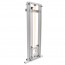
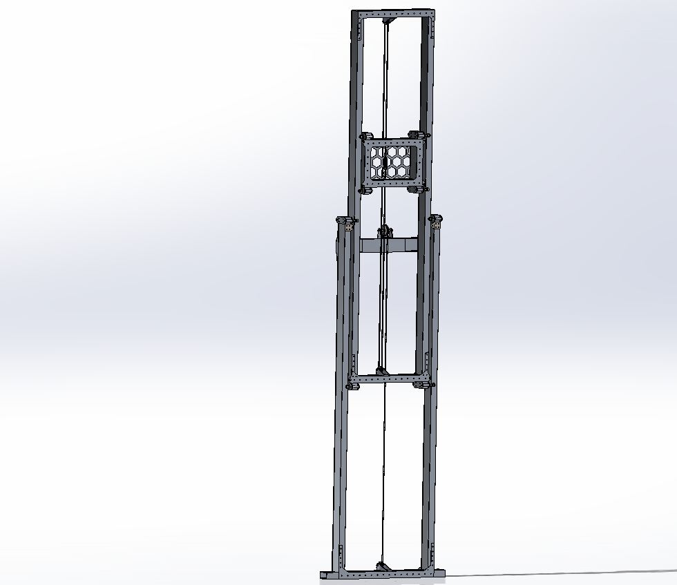

# Elevator
You now know how to make three major subsystems that our team uses. In this lesson, it is time to learn a subsystem that works in a very similar way to the arm subsystem: the elevator. In this lesson the purpose of the elevator will be explained and the basic code to run the subsystem will be gone over.
## Subsystem Overview

                           

### Purpose

## Subsystem File

### Declaring Motor Controllers

### States

### Constructor

### Update Function and setElevatorSpeed()

### Shuffle Board Functions

### State Functions

## Elevator Manual Command

