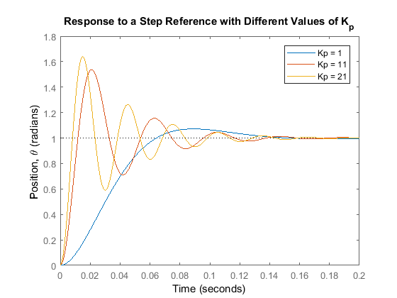

# Basics of PID

> [!WARNING]
> Some calculus is mentioned in this documentation, but don't worry if you haven't taken calculus. We will explain everything you need to know

PID control, or **P**roportional-**I**ntegral-**D**erivative control, is a method of controlling a system to achieve a desired state. Here, we will only be going over how PID applies to position, but we will go over how we can control velocity later.

## Positional PID

One of the most common applications of PID is to try to get a certain mechanism into a certain exact position with a reasonable amount of error. For instance, we might want to make our elevator rise to an exact height of 60 inches off the ground. To do this with PID, we first need a sensor to measure the quantity we want to control. In this case, we would have to somehow measure the height of our elevator. We could do this with a distance sensor at the bottom, or we could use an encoder attached to the elevator motor alongside some math to see what the position of elevator is.

After this, we measure something known as **error**, which is defined as `error = setpoint - current`. For instance, if the current height of our elevator is 40 inches off the ground, the error would be `error = 60 - 40 = 20`. You can think of one of the purposes of PID control as driving the error towards 0.

The main idea of PID control is how we turn that error term into a motor output that we can use to drive that error to 0. There are three components of PID control, each of which can be used independently of one another, and which produce the best results when used all together.

> [!NOTE]
> Here, we are assuming that a positive motor output will increase our sensor reading. So when we apply a positive motor output, the elevator will rise up. This is important to note and if it this is not the case, we have to invert our motor controller.

> [!TIP]
> When writing constants, we will frequently use kP to represent the P constant for PID. This is a notation known as Hungarian notation and involves simply putting the letter "k" before the constant name. This is pretty common, so we use it as well.

## P term

When we are just using the **P**roportional term of our PID controller, we apply a motor output that is **proportional** to our error. The way this work is that we essentially apply an output that is equal to `-error * kP` where `kP` is the P constant for our PID controller. For instance, we might have something like the following:

```java
// set these up once
double kP = 0.01;

// loop this
double error = setpoint - encoder.getPosition();
motor.set(kP * error)
```

The idea behind this is that if we are far away from our desired state, we want to apply a larger motor output to get us there faster. However as we close in on the desired setpoint and our error decreases, we want to decrease out output so we can accurately hone in on that desired value.

### Effects of P

One important concept to understand is how different `kP` values will affect the response of the system. We can summarize this in the table below:

| kP | Oscillations | Speed |
| :-: | :-: | :-: |
| ↑↑ (increase) | ↑↑ (increase) | ↑↑ (increase) |
| ↓↓ (decrease) | ↓↓ (decrease) | ↓↓ (decrease) |

If we graph our sensor value compared to the setpoint over time, we can create some really informative graphs (image from [MATLAB and Simulink Control Tutorials](http://ctms.engin.umich.edu/CTMS/index.php?example=MotorPosition&section=ControlPID))



## D term

We're going to skip the I term for now and cover the **D**erivative term.

> [!TIP]
> You can think of a derivative as the "speed of the error" or, more formally, the rate of change of the error. Essentially, we're looking at how fast the error is decreasing.

The purpose of the derivative term is to slow down the motor output of our controller so that it does not approach the setpoint too fast. This helps prevent the oscillations that were present in the `kP` graphs shown above. The way it works is that we take the derivative of the error term (or we approximate it), we multiply it by a constant, and then we subtract it from what we obtain from the P term.

```java
// set these up once
double kP = 0.01;
double prevError = 0.0;

// loop this
double error = setpoint - encoder.getPosition();
double dError = (error - prevError) / (currentTime - prevTime);

prevTime = currentTime;
prevError = error;
motor.set(kP * error - kD * dError);
```

The idea behind this is that if we are going too fast and we might overshoot, our derivative will become higher and then we will more off, which will decrease our motor output. Note that this may even turn out motor output negative in an effort to slow down our mechanism more dramatically.

### Effects of kD

One important concept to understand is how different `kD` values will affect the response of the system. We can summarize this in the table below:

| kD | Oscillations | Speed | Overshoot |
| :-: | :-: | :-: | :-: |
| ↑↑ (increase) | ↓↓ (decrease) | ↓↓ (decrease) | ↓↓ (decrease) |
| ↓↓ (decrease) | ↑↑ (increase) | ↑↑ (increase) | ↑↑ (increase) |

One important thing to notice is that while increasing `kP` increases the speed of our system, it overall decreases the stability. On the other hand, increasing `kD` decreases the speed of our system, but decreases stability. Finding the perfect balance between the two requires a good amount of experience and judging of what our subsystem needs.

## I term

TODO

### Effects of kI

TODO

## Types of Controllers

Note that we have discussed 3 different aspects of PID, but sometimes we don't want to use all three. For instance, the I term is frequently unwieldy for FRC situations and we simply don't need it to effectively control our subsystems. As a result, we frequently just use PD controllers without the I component. There are various other controllers such as just P and the full-fledged PID, but PD is probably the most common for us.

When we are writing simple P controllers, they are generally so simple that we can write them ourselves. However when we bring in other terms, it becomes much easier to just use either motor controller builtin PID or WPILib's `PIDController`.

## Example

The following video shows a really good hardware demo of the effect of different PID controllers. Some of the stuff isn't 100% applicable such as the refresh rate, but the overall content is still super good.

<iframe width="560" height="315" src="https://www.youtube.com/embed/fusr9eTceEo" frameborder="0" allow="accelerometer; autoplay; encrypted-media; gyroscope; picture-in-picture" allowfullscreen></iframe>

## Tuning PID

One of the most critical parts about a PID controller is learning how to tune it depending on what kind of response you get.
