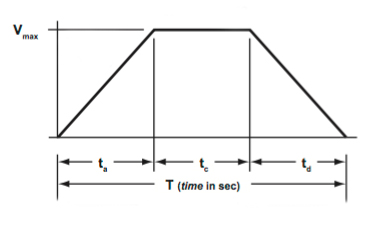

# Motion Profiling

## Limits of PID

While PID is extremely powerful, it definitely lacks some traits and leaves much to be desired when thinking about the ideal control method. First of all, PID is very prone to overshooting. While this could be solved with an increase to the `kD` term, too much increasing will lead to a slow response. It is difficult to find the precise parameters that will give us both a smooth response that doesn't overshoot and moves quickly.

Additionally, PID accelerates very quickly at the beginning as the initial error is very large. This can lead to system instability that could damage our system or make it lose its grip on game pieces. Again, increasing the `kD` term can help us balance this out, but this also leads to a slower convergence to the final goal. Finding the perfect combination of PID parameters can be extremely difficult and maybe even nonexistent. 

The final problem is that PID is dependent on our robot's battery voltage. If our battery is not fully charged due to bad batteries or an accident, then the PID outputs will not be as strong and could mess up our tuning. Fortunately, we have another option: **motion profiling**.

## Motion Profiling

Motion profiling is essentially a method of using the physical constraints of your system (maximum velocity and maximum acceleration) and generating a *profile*, or plan, of the exact movement of the system to accomplish a certain task. For instance, if we wanted to go forward 10 feet and we knew our robot's maximum velocity and acceleration, we could generate an exact profile that tells us where we should be and what speed we should be at for every time step in our path. 

For example, we could have a profile like this, which tells us the exact velocity we need to be moving at each time step to accomplish a smooth motion. (Credit to [Linear Motion Tips](https://www.linearmotiontips.com/how-to-calculate-velocity/))



Once we generate this motion profile, which in this case is a **trapezoidal motion profile**, we can follow it exactly and guarantee that we will reach our target goal. For each target distance we want to move, we will have to generate a new motion profile that will get us there. However, we need to somehow be able to follow this velocity graph over time to follow this motion profile. Fortunately, we just did a whole section on this, so we are well equipped to tackle motion profiling! Now, we just need to figure out how to generate the motion profile.

Some advantages of this motion profile are that a) we can make the system obey a certain maximum velocity and acceleration, which will be parameters we pass in once we generate the motion profile, and b) we can know exactly how long the movement will take. Due to condition (a), we can also increase the stability of our mechanism easily by just adjusting the parameters such as the max velocity and acceleration.

### Generating Trapezoidal Profile

There are various types of motion profiles, but the most basic one that we will be using is a trapezoidal motion profile. The trapezoidal motion profile consists of 3 parts, accelerating up to our maximum velocity at our designated maximum accceleration, then cruising at the maximum velocity, and finally deccelerating from our maximum velocity back to 0 at the negative of our designated maximum acceleration. If you look at the diagram above, these are represented by the $t_a$, $t_c$, and $t_d$ present on the x-axis.

Sometimes, the distance we need to go is so short that we don't have time to go to a cruising velocity. We can instead use a triangular motion profile instead, which is just where $t_c = 0$, or we spend no time cruising. Instead, halfway through our motion, we go straight from accelerating to deccelerating.

We don't actually have to worry about generating these profiles alone, since WPILib provides the `TrapezoidProfile` class to handle all of these calculations for us. However, I'm going to take a dive into deriving these physics below. Feel free to skip it if you're not interested.

### Physics of Generating Trapezoidal Profiles

We are given the following constants when trying to generate a trapezoidal motion profile, acceleration $a$, max velocity $v_{max}$, and distance $d$. To create the motion profile, we have to use the kinematic equations, which are listed below.

$$v = v_0 + at$$
$$\Delta x = \left(\frac{v + v_0}{2}\right)t$$
$$\Delta x = v_0 t + \frac{1}{2}at^2$$
$$v^2 = v_0^2 + 2a \Delta x$$

First of all, we have to determine if we are going to be using a triangular profile or a trapezoidal profile. This means that we need to determine whether or not we will even be able to accelerate to the maximum velocity and then deccelerate to a stop before going the distance $d$. To do so, we can use the kinematic equations to determine the distance required to accelerate to the velocity $v_{max}$ from the initial velocity $v_0 = 0$.

$$v_{max}^2 = 0^2 + 2ax \rightarrow x = \frac{v_{max}^2}{2a}$$

Now we have two cases: either $x \leq \frac{d}{2}$ or $x > \frac{d}{2}$. For the first case, this means that when accelerating to the max speed and then deccelerating, we will actually go **farther** than our desired distance, which is bad. This means that we should **not** go all of the way to our max speed, but instead go to some intermediate speed. This is known as a triangular profile, and can be done by determining the length of time we need to spend accelerating to go halfway to our destination. Then, the same time will be spent deccelerating.

$$\frac{d}{2} = 0 * t + \frac{1}{2}at_a^2 \rightarrow t_a = t_d = \sqrt{d / a}$$

Now, we know how long this triangular profile will last during each segment, and we just need to know what the desired velocity is during each time $t$. For the first half of our motion when $0 \leq t \leq t_a$, we have that $$v = at$$

For the second half of our motion when $t_a \lt t \leq t_a + t_d$, we have that $$v = at_a - a(t - t_a) = 2at_a - at$$.

This concludes the triangular profile, and now we can go onto the trapezoidal profile. For the trapezoidal profile, we know that we can safely accelerate to our maximum velocity, cruise at that velocity for some time, and then deccelerate. To calculate how long it will take to accelerate and deccelerate, we can use the kinematic equations again.

$$v_max = 0 + at_a \rightarrow t_a = t_d = \frac{v_max}{a}$$

We also need to calculate the distance that we travelled during this time, which can be done with the following equation:

$$v_max^2 = 0^2 + 2ax \rightarrow x = \frac{v_max^2}{2a}$$

We then know that we will need to cruise at our max velocity for the remainder of the distance, which means that we will need to cruise for the time

$$t_c = \frac{d - 2x}{2}$$

Now, we have all of the time intervals for which we have to do each action. I'm not going to go exactly into how to calculate the velocity during each time interval since it's pretty similar to the triangular motion profile section.

With that, we're done with generating our trapezoidal motion profile! Now we just need to implement it in code, for which we have two options: the WPILib built-in version and the SPARK MAX Smart Motion.

## Using WPILib TrapezoidProfile

There are two primary steps of doing motion profiling: a) generating the motion profile and b) following it. To do the first, we can use the built in WPILib `TrapezoidProfile` class, which takes in both the constraints, the beginning state, and the end state of our system. Upon generating the profile, we can then query it at each time step for what velocity and position we **should** be at. Then, we can pass this into our positional PID and velocity PID controllers.

Generally, we could use either WPILib's `PIDController` or the built-in SPARK MAX PID. However, we actually want to run *two* control loops, one to hone in on the desired velocity, and the other to hone in on the desired position. The velocity one wil be doing most of the work, and the PID one will be correcting for any built up error.

First, let's generate the profile. Essentially, we want it so that every time we call the function to move to a specific location, we want to generate a brand new trapezoid profile between our current position and the desired position. We can use our current velocity and position as the initial state of our profile, and the desired position and a velocity of `0` as the desired end state of our profile. Let's take a look at how we would do that in code.

```java
public class Elevator extends SnailSubsystem {

    private CANSparkMax motor;
    private CANEncoder encoder;

    public enum State {
        MANUAL,
        PROFILED
    }

    private State state = State.MANUAL;
    private double speed;
    private TrapezoidProfile profile;
    private Timer profileTimer;

    public Elevator() {
        motor = new CANSparkMax(ElectricalLayout.ELEVATOR_MOTOR_ID, MotorType.kBrushless);
        motor.restoreFactoryDefaults();
        motor.setIdleMode(IdleMode.kBrake);

        encoder = motor.getEncoder();
        encoder.setPositionConversionFactor(Constants.Elevator.ELEVATOR_CONV_FACTOR);        // convert to distance
        encoder.setVelocityConversionFactor(Constants.Elevator.ELEVATOR_CONV_FACTOR / 60.0); // convert to distance / second

        // we initialize our profile to null because we don't need it at the moment while in MANUAL control
        profile = null;
        profileTimer = new Timer();
    }

    @Override
    public void update() {
        switch(state) {
            case MANUAL:
                motor.set(speed);
                break;
            case PROFILED:
                // we will go over this later
                break;
        }
    }

    public void setElevatorSpeed(double speed) {
        this.speed = speed;
        state = State.MANUAL;
    }

    public void setPosition(double setpoint) {
        // we need three parameters: constraints, desired state, initial state
        profile = new TrapezoidProfile(
            new TrapezoidProfile.Constraints(Constants.Elevator.ELEVATOR_PROFILE_MAX_VEL, 
                Constants.Elevator.ELEVATOR_PROFILE_MAX_ACC),
            new TrapezoidProfile.State(setpoint, 0), // we want to go to our setpoint and stop there at a velocity of 0
            new TrapezoidProfile.State(encoder.getPosition(), encoder.getVelocity()) // our current position and speed
        );
        state = State.PROFILED;
        profileTimer.reset();
        profileTimer.start();
    }

    // ends the profile in case we need to get back manual control for some reason
    public void endClosedLoop() {
        profile = null;
        state = State.MANUAL;
    }
}
```

We need to pass our parameters into the `TrapezoidProfile` constructor in a particularly curious way, where we need to create these other objects and then pass the values in. Other than that, it's pretty self-explanatory. However, one thing to note is that in order to query our profile, we need to pass in the time that has passed since the profile has begun. This way, we can actually calculate the correct position into our profile. To do this, we can use a WPILib `Timer` object, and then start it once we begin our profile. Now, we just need to follow our profile.

To do so, we first need to query our `TrapezoidProfile` object, which will tell us the current position and velocity we should be going at. We can then pass these into two PID controllers. We have a few options for how exactly we could implement these PID controllers, but what I'm going to do is basic `P` control for position, and then use the WPILib `PIDController` for the velocity calculation. We also need to augment the `PIDController` with the `kFF` term. Let's check that out in our `update()` function:

```java
@Override
public void update() {
    switch(state) {
        case MANUAL:
            motor.set(speed);
            break;
        case PROFILED:
            TrapezoidProfile.State desiredState = profile.calculate(profileTimer.get());
            double desiredPosition = desiredState.position;
            double desiredVelocity = desiredState.velocity;

            // do the calculations for P on the position
            double positionError = desiredPosition - encoder.getPosition();
            double positionOutput = positionError * Constants.Elevator.ELEVATOR_PROFILE_P;

            // pass the new setpoint into the velocity PID controller and then calcualte
            velocityPIDController.setSetpoint(desiredVelocity)
            double velocityOutput = velocityPIDController.calculate(encoder.getVelocity());
            double velocityFeedforward = desiredVelocity * Constants.Elevator.ELEVATOR_PROFILE_VEL_F;

            // add them all up and pass into our motor!
            motor.set(positionOutput + velocityOutput + velocityFeedforward)
            break;
    }
}
```

Note that we had a lot of control over exactly how we used the motion profile position and velocity we received. In fact, we could augment this further by using SPARK MAX PID to achieve the velocity, using arbitrary feedforward, or even some other fancy control method. Now, we'll go over an easier, but less robust form of following motion profiles.

## Using SPARK MAX Smart Motion

An alternative to generating the trapezoidal profile ourselves and following it is to use a built-in feature of the SPARK MAXes: Smart Motion. This feature allows you to enter into the controller the max velocity and max acceleration you would like in the motion profile, as well as the velocity PID terms. Then, you simply tell it to go to a certain encoder position, and it will automatically generate the trapezoidal motion profile to achieve that. It's incredibly easy to set up, making it a great way to quickly achieve motion profiled control.

```java
public class Elevator extends SnailSubsystem {

    private CANSparkMax motor;
    private CANPIDController elevatorPID;
    private CANEncoder encoder;

    public enum State {
        MANUAL,
        PROFILED
    }

    private State state = State.MANUAL;
    private double speed;
    private double setpoint;

    public Elevator() {
        motor = new CANSparkMax(ElectricalLayout.ELEVATOR_MOTOR_ID, MotorType.kBrushless);
        motor.restoreFactoryDefaults();
        motor.setIdleMode(IdleMode.kBrake);

        encoder = motor.getEncoder();
        encoder.setPositionConversionFactor(Constants.Elevator.ELEVATOR_CONV_FACTOR);        // convert to distance
        encoder.setVelocityConversionFactor(Constants.Elevator.ELEVATOR_CONV_FACTOR / 60.0); // convert to distance / second

        elevatorPID = motor.getPIDController();
        // our velocity PID constants
        elevatorPID.setP(Constants.Elevator.ELEVATOR_PIDF[0]);
        elevatorPID.setI(Constants.Elevator.ELEVATOR_PIDF[1]); // most of the time this would be set to 0
        elevatorPID.setD(Constants.Elevator.ELEVATOR_PIDF[2]); // most of the time this would be set to 0
        elevatorPID.setFF(Constants.Elevator.ELEVATOR_PIDF[2]);
        // our smart motion constraints
        elevatorPID.setSmartMotionMaxVelocity(Constants.Elevator.ELEVATOR_PROFILE_MAX_VEL);
        elevatorPID.setSmartMotionMaxAccel(Constants.Elevator.ELEVATOR_PROFILE_MAX_ACC);
    }

    @Override
    public void update() {
        switch(state) {
            case MANUAL:
                motor.set(speed);
                break;
            case PROFILED:
                elevatorPID.setReference(setpoint, ControlType.kSmartMotion);

                // you can add some stuff to check if it reached its setpoint or not
                // left as an exercise to the reader
                break;
        }
    }

    public void setElevatorSpeed(double speed) {
        this.speed = speed;
        state = State.MANUAL;
    }

    public void setPosition(double setpoint) {
        this.setpoint = setpoint;
        state = State.PROFILED;
    }

    // ends the profile in case we need to get back manual control for some reason
    public void endClosedLoop() {
        state = State.MANUAL;
    }

    // should also add outputting data via outputValues() and constant tuning, but omitted here
}
```

Notice that unlike the previous section where we also had a separate control loop for running positional control, the Smart Motion parameters do not include that. This is one of the reasons we might not use Smart Motion: we don't have as much control over the parameters and how we choose to follow them. However, since the onboard PID runs more accurately than a RoboRIO one, we will also have better control over our velocity, which means that we don't need the positional PID correction as much.

## Profiled Command

We're not going to discuss creating a command here because it would be the same as the PID version of the command, but we'd call a different function. Check out those sections if you need a refresher.

## Determining Velocity / Acceleration

There are several ways to determine the velocity and acceleration used for the system. Generally, however, you do **not** want to use the maximum possible velocity and acceleration the motor can output. This is because it can a) lead to instability, b) easily burn out the battery and c) not be reliable at inconsistent battery voltages. We typically use something a bit less than our maximum possible parameters to ensure a smooth and controlled motion.

To actually determine the maximum possible parameters however, we have a few options. To do all of them, we need to first run our subsystem at maximum speed manually while monitoring the position of it via something like an encoder. To actually read the values from this and determine our parameters, we can do two things:

The first is to have the encoder output the velocity to Shuffleboard every update loop and to calculate the acceleration between updates to output to Shuffleboard as well. Then we can observe the graphs, and eyeball a good approximation of the maximum parameters. Using code to output the maximum parameters can be problematic due to noise in the reading.

Another way that is more reliable would be to graph the position and velocity to a CSV file on our RoboRIO and then download that file to our computer. We will cover how to create files more in depth later in the advanced sections, but once we do this, we can then plot the data in a program like Google Sheets or Excel and perform a linear regression / quadratic regression to determine the values for our velocity and acceleration.

## Limits of Motion Profiling

While motion profiling is incredibly powerful and can lead to really smooth and good-looking results, it still has its own issues. The most prevalent issue is that motion profiling can't deal with disruptances very well as the profile follows a predetermined motion. If something such as a collision or mechanical issue moves the mechanism during its profile, the control loop will not be able to account for this in real time. Including the `kP` term with our motion profile helps us account for this, but it'll frequently have a small value so it can't do much to majorly correct the subsystem from its deviation. 

## Sources

If you want more information, I would strongly recommend reading / watching the sources below, which were used to help write this article.

* https://blog.wesleyac.com/posts/intro-to-control-part-five-feedforward-motion-profiling
* https://docs.wpilib.org/en/stable/docs/software/advanced-control/controllers/trapezoidal-profiles.html
