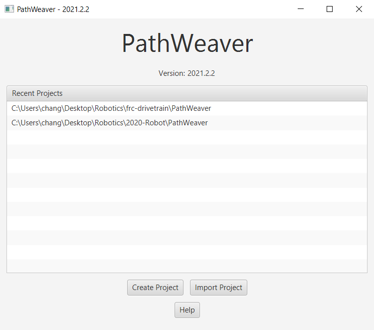
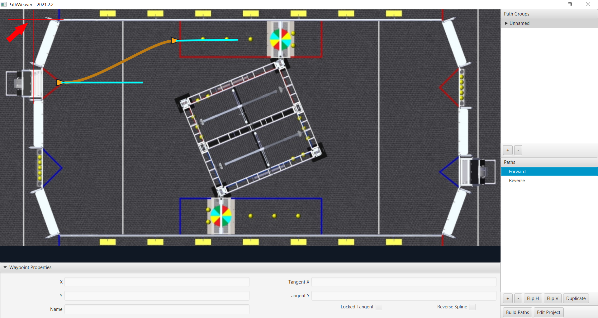

# Generating Trajectories

The first step of following trajectories is to actually generate them. In the previous article on segmented trajectories, we went over how one needs to use the field cad to do the measurements. The same is true for curved trajectories, although we will be using another tool: PathWeaver.

## PathWeaver

To start PathWeaver, first open up the WPILib version of VSCode. Then, go to the WPILib icon in the top right and type in `Start Tool`. Press enter, and then click on PathWeaver to open it.

When you open PathWeaver, you may be greeted by an interface that looks like this:

Press `Create Project` to get started or click on an existing project to open it. For the settings, do the following:

- `Project Directory`: Set this to the same root directory as your robot code. This should be the file that contains the `src` directory, `build.gradle`, `gradlew`, etc.
- `Output Directory`: Leave this blank
- `Game`: Set this to the game you want the field for
- `Length and Export Unit`: Meters (important)
- `Max Velocity and Acceleration`: Just put random values in here for now (preferably between 1 and 5 though, don't put anything too low or too high). When testing on the actual robot, we can find out these values empirically.
- `Wheel Base`: This is normally `0.5842m`, but it can change depending on the year. Make sure to doublecheck your measurement when you get the actual robot. It should be the distance between the centers of the wheels on opposite sides.

## Creating Paths

After generating your project, you should be greeted with the following interface:

First, we must talk about what exactly a `path` is in PathWeaver. A path is a single curved line that goes between two waypoints. Waypoints are just points on the field that also have a direction, or heading, associated with them. When you click on a waypoint in PathWeaver, you can use the text boxes on the bottom left to control exactly where the triangle is with the X and Y, and you can use the text boxes on the bottom right to control the tangent direction, which defines the direction the robot is facing. You can either type in exact values here or drag around the points with your mouse.

> [!NOTE]
> It is highly advised that you do not use the dragging around feature besides just to get an idea of what the path will look like.
> For paths that will go on the robot, you should instead use field measurements to determine exactly where the positions we wish to go are as well as the tangents. On the below image, the red arrow marks where (0, 0) is.

The way we create paths in PathWeaver is by pressing the plus button in the bottom right. This will create a new path that you will see on the bottom right. You will also notice the path displayed in orange with the waypoints determining the path marked as orange triangles. The bright cyan lines determine the tangent vectors.

When the orange path is filled in, this means that this is a forward trajectory, meaning that the robot will be driving forwards while following this. However, there are times when we want to actually drive our robot backwards. To do this, we can click the `Reverse Spline` checkbox in the bottom right. This will flip the headings so that the robot is actually driving backwards while following the path.

## Creating Path Groups

If we wanted to make more complicated paths, we can actually create multiple paths and run them consecutively. To help visualize this easily, PathWeaver has something built in called Path Groups. Press the plus button in the top right to create a path group, and then drag the paths in the bottom panel into the group. When you click on the group, you should be able to see all of your paths at the same time, which is really convenient for visualizing how the entire path flows.

> [!WARNING]
> The above image is NOT a good example of what a path group should look like since it just has two random paths in it that aren't linked at all. The purpose of path groups is for multiple paths that will be run consecutively.

## Exporting Paths

The final step of creating trajectories is to export them and put them in the correct place so that they are sent to the robot when we deploy our code. In the bottom left, press `Build Paths`. If you check VSCode, you should now see a folder called `PathWeaver`. This folder contains all of the PathWeaver files, but the folder we really care about is `PathWeaver/output`. This ccontaisn all of the generated `.json` files that make up our paths. Select these files and copy them in the file browser. Then, paste them in the following folder:
`src/main/deploy/paths` (you will have to make the paths folder)

> [!NOTE]
> The reason why we don't set PathWeaver to just automatically dump all paths in there is because when we do this, this ensures that we have complete control over which paths we choose to send to the robot. For instance, we wouldn't wnat to send a random test path that we did scribbles on to the robot. Additionally, as of now, PathWeaver cannot delete generated paths that were created previously but were now deleted, so to make sure unnecessary paths are deleted, we should do the copying outselves.

With that, we're done with generating the paths! In the next article, we will go over how to read these files into our robot program!
