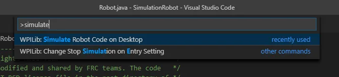
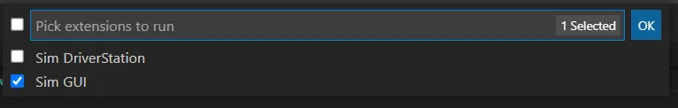
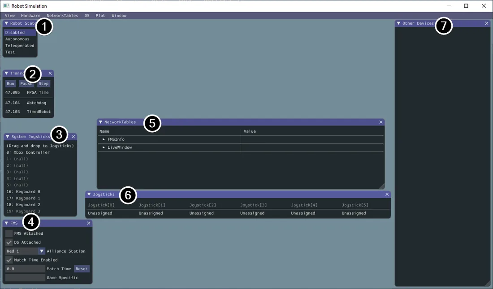
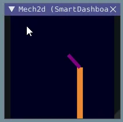

# Simulation
A lot of times, we don't have a physical robot (not trying to blame anyone) to use, so as members of the programming team, we have to simulate the robot. We have to do something while we wait!

## How it works
[WPILib](https://docs.wpilib.org/en/stable/docs/software/wpilib-tools/robot-simulation/index.html) actually makes it really easy to do this out of the box. 

All you have to do is run the simulate command in VSCode.


Then select the sim gui (you don't have to select driver station) 


Then this screen will appear which will allow you to control the simulation.


1. Robot State - This is the robot’s current state or “mode”. You can click on the labels to change mode as you would on the normal Driver Station.
2. Timing - Shows the values of the Robot’s timers and allows the timing to be manipulated.
3. System Joysticks - This is a list of joysticks connected to your system currently.
4. FMS - This is used for simulating many of the common FMS systems.
5. NetworkTables - This shows the data that has been published to NetworkTables.
6. Joysticks - This is joysticks that the robot code can directly pull from.
7. Other Devices - This includes devices that do not fall into any of the other categories, such as the ADXRS450 gyro that is included in the Kit of Parts or third party devices that support simulation.

## How to use it
You can't run any robot code in the simulation. WPILib will simulate the motors and you'll be able to control them, but you won't be able to see how these movements effect the robot. To do that, we need to add some code to simulate mechanisms in our project and display them. Fortunately, [WPILib](https://docs.wpilib.org/en/stable/docs/software/wpilib-tools/robot-simulation/physics-sim.html) has also given us a bunch of simulated mechanisms that we can use:

- LinearSystemSim, for modeling systems with linear dynamics
- FlywheelSim
- DifferentialDrivetrainSim
- ElevatorSim, which models gravity in the direction of elevator motion
- SingleJointedArmSim, which models gravity proportional to the arm angle

With these classes, we can simulate the robot's mechanisms and display them on the screen using `Mechanism2D` and the shuffleboard.

Here is an example of an elevator from the documentation
```java
// Simulation classes help us simulate what's going on, including gravity.
private final ElevatorSim m_elevatorSim =
    new ElevatorSim(
        m_elevatorGearbox,
        Constants.kElevatorGearing,
        Constants.kCarriageMass,
        Constants.kElevatorDrumRadius,
        Constants.kMinElevatorHeightMeters,
        Constants.kMaxElevatorHeightMeters,
        true,
        VecBuilder.fill(0.01));
private final EncoderSim m_encoderSim = new EncoderSim(m_encoder);
```

Then we can create Mechanisms
```java
// the main mechanism object
Mechanism2d mech = new Mechanism2d(3, 3);
// the mechanism root node
MechanismRoot2d root = mech.getRoot("climber", 2, 0);

// and draw them on screen
m_elevator = root.append(new MechanismLigament2d("elevator", kElevatorMinimumLength, 90));
// post the mechanism to the dashboard
SmartDashboard.putData("Mech2d", mech);

...

// and update it periodically
@Override
public void robotPeriodic() {
    // update the dashboard mechanism's state
    m_elevator.setLength(kElevatorMinimumLength + m_elevatorEncoder.getDistance());
}
```

Then we can see it on the screen in the shuffleboard and move it with real physics!


## How to use it in our Code
Putting all of this simulation code into our subsystems would be a mess. This is why using an IO system like in Advantage Scope is useful because it separates the sim and real code. It still uses the same underlying logic, but uses the IO system to abstract motors away.

Like this 
```
subsystems
    - elevator
        - Elevator.java
        - ElevatorIO.java
        - ElevatorIOSim.java
        - ElevatorIOSparkMax.java
```

TODO add more info here