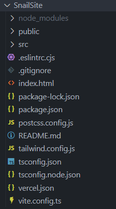

# Folders & Files in `SnailSite/`

Let's view the overall folder structure.



# `index.html`

The most relevant file to focus on is `index.html`.

```html
<!DOCTYPE html>
<html lang="en">
  <head>
    <meta charset="UTF-8" />
    <link rel="icon" type="image/png" href="/pics/favicons/favicon.ico" />
    <meta name="viewport" content="width=device-width, initial-scale=1.0" />
    <meta name="theme-color" content="#000000" />
    <meta
      name="description"
      content="Learn more about team 1257, Parallel Universe, and our mission to inspire the next generation of STEM leaders."
    />
    <meta property="og:image" content="/pics/social_link.png" />
    <link rel="apple-touch-icon" href="/pics/favicon/logo192.png" />
    <meta property="og:title" content="Team 1257 | Parallel Universe" />
    <meta
      property="og:description"
      content="Learn more about team 1257, Parallel Universe, and our mission to inspire the next generation of STEM leaders."
    /> 

    <title>Team 1257 | Parallel Universe</title>
  </head>
  <body>
    <div id="root"></div>
    <script type="module" src="/src/main.tsx"></script>
  </body>
</html>
```

This file provides the metadata necessary for search engines like Google to find and display the website.

## Logo Update

Update the following lines and respective files if our logo is ever changed:

`<link rel="icon" type="image/png" href="/pics/favicons/favicon.ico" />`
- the icon that shows up on a browser tab

`<meta property="og:image" content="/pics/social_link.png" />`
- the logo that is displayed on social media (e.g., on Discord)

`<link rel="apple-touch-icon" href="/pics/favicon/logo192.png" />`
- the logo displayed on Apple devices under certain circumstances

# `public/`

I primarily use `public/` to store logos in `pics/`. You may find other files in `public/`, but they are mostly redundant or irrelevant. Note that through the development process, the way I stored images was somewhat inconsistent since most are stored within `src/` (I will touch on this later).

# `src/`

As the folder name suggests, the majority of the source code is found within this folder. Proceed to the next section to learn more about it.
