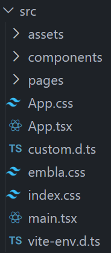

# Folders & Files in `src/`

Let's view the structure of `src/`.



You should see three primary folders: `assets/`, `components/`, and `pages/`. As you should expect, `assets/` mostly contains images, `components/` mostly contains the custom React components I developed, and `pages/` organizes the components into standalone pages on the website.

# `pages/`

If you take a look at `App.tsx`, you'll see how the different links on the website correspond to a certain page. For example, `Home.tsx` is displayed when you directly visit [frc1257.org](https://frc1257.org/), `Leadership.tsx` is displayed when you visit [frc1257.org/leadership](https://frc1257.org/leadership), etc.

```tsx
const router = createBrowserRouter([
  {
    element: <Layout />,
    errorElement: <NotFound />,
    children: [
      {
        path: "/",
        element: <Home />,
      },
      {
        path: "info",
        element: <Info />,
      },
      {
        path: "awards",
        element: <Awards />,
      },
      {
        path: "support",
        element: <Support />,
      },
      {
        path: "sponsors",
        element: <Sponsors />,
      },
      {
        path: "leadership",
        element: <Leadership />,
      },
      {
        path: "donate",
        element: <Donate />,
      },
      {
        path: "linktree",
        element: <LinkTree />,
      },
      {
        path: "gallery",
        element: <Gallery />,
      },
      {
        path: "outreach/*",
        element: <OutreachRouter />,
      },
    ],
  },
]);
```

## Outreach Pages

You'll notice that the pages for outreach actually have their own separate router in `OutreachRouter.tsx`. This is because several pages fall under the `../outreach/..` subdirectory. The files associated with these pages can be found in `pages/outreachPages/`.

```tsx
const OutreachRouter = () => {
  return (
    <Routes>
      <Route path="" element={<Outreach />} />
      <Route path="school" element={<SchoolOutreach />} />
      <Route path="local/*" element={<LocalOutreachRouter />} />
      <Route path="mar/*" element={<MAROutreachRouter />} />
      <Route path="first" element={<FIRSTOutreach />} />
    </Routes>
  );
};
```

# Image Storage

You'll notice that images are stored in both `components/` and `assets/`. 

`assets/` mainly contains three sets of images: `imgGallery/`, `leadershipImages`, and `sponsors/`. `imgGallery/` images are displayed as a masonry layout on the `Gallery.tsx` page. `leadershipImages` are displayed on the `Leadership.tsx` page. `sponsors/` are displayed on the `Sponsors.tsx` page.

`components/` contains more miscellaneous images. For example, images used on the Outreach pages are stored in `outreach/`. `backgrounds/` contain the galaxy backgrounds used in the navbar. `robots/` contains robot pictures from the past but is not currently displayed anywhere.