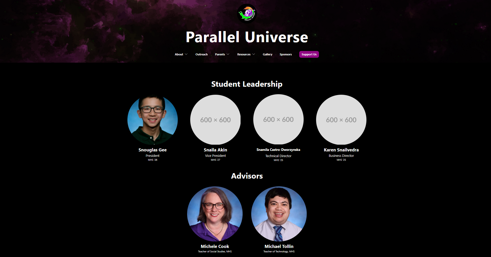

# Student Leadership

At the end of each school year, the very first thing you likely need to do is update the leadership page.

# Tutorial

To understand how to update this section, let's run through a scenario. Suppose that in a parallel universe, there are only four positions: President, Vice President, Technical Director, and Business Director. The four people chosen for these roles are Snouglas Gee, Snaila Akin, Snamila Castro-Dworzynska, and Karen Snailvedra. We want everyone to be displayed in this order on the Leadership page. Let's also say that for the time being we could only find a profile image for Snouglas, which we'll call `snouglas.jpg`. Alright, let's get started!

Locate `leadershipProfiles.ts` under `pages/`. It should look something like this:

```ts
import { LeaderProfilePropsList } from "../components/LeaderProfile";

import kamila from "../assets/leadershipImages/kamila.jpg";
import douglas from "../assets/leadershipImages/douglas.jpg";

// abridged from full 2024-2025 list

const leadership: LeaderProfilePropsList = [
  {
    name: "Douglas Gee",
    position: "Vice President",
    schoolgrade: "MHS '26",
    image: douglas,
  },
  {
    name: "Kamila Castro-Dworzynska",
    position: "Technical Director",
    schoolgrade: "MHS '25",
    image: kamila,
    fontsize: "lg:text-xl text-md",
  },
  {
    name: "Gali Avni",
    position: "Documentation Director",
    schoolgrade: "MHS '25",
    image: "https://placehold.co/600x600",
  },
  {
    name: "Antonios Theocharopoulus",
    position: "Programming Co-Manager",
    schoolgrade: "AIT '25",
    image: "https://placehold.co/600x600",
    fontsize: "lg:text-xl text-md",
  },
];

export default leadership;
```

Immediately, remove everything within the `leadership` array so we can start from scratch.

```ts
const leadership: LeaderProfilePropsList = [];
```

To add in Snouglas, let's add the following to the list:

```ts
const leadership: LeaderProfilePropsList = [
  {
    name: "Snouglas Gee",
    position: "President",
    schoolgrade: "MHS '26",
  },
];
```

At this point, your typechecker is probably warning you that `Property 'image' is missing in type '{ name: string; position: string; schoolgrade: string; }' but required in type 'LeaderProfileProps'`! Don't worry, as the error suggests, we're missing an `image` key. Before we do anything about that though, let's actually put our `snouglas.jpg` image into the right folder.

Locate `src/assets/leadershipImages/` and delete all the images inside (of course, keep the pictures of Mrs. Cook, Mr. Tollin, and any carryover leadership). Then, simply add in `snouglas.jpg`!

> [!WARNING]
> At the very least, ensure that the images you use are square. I recommend asking for the yearbook photos and then manually cropping them into a square. After cropping, the yearbook photos should be around `640x640`, but it doesn't really matter so long as they're square.

Alright, let's go back into `leadershipProfiles.ts`. Add the following lines:

```ts
import snouglas from "../assets/leadershipImages/snouglas.jpg";

const leadership: LeaderProfilePropsList = [
  {
    name: "Snouglas Gee",
    position: "President",
    schoolgrade: "MHS '26",
    image: snouglas,
  },
];
```

Now, you should see that Snouglas Gee is proudly displayed on the leadership page!

> [!TIP]
> The actual name you import `snouglas.jpg` as doesn't really matter, but it just helps to name the variable the same thing to make it easier to keep track of things.

> [!NOTE]
> Truthfully, the formatting might look a little off at this point in time. That's because I designed the Leadership page to have 4 elements per row. Once all 4 positions are populated (all 10+ roles when you're actually updating it), it should look normal. See [More on Formatting](https://frc1257.github.io/robotics-training/#/website/2-Annual_Updates/1-Student_Leadership?id=more-on-formatting) if the formatting is still weird.

Now, let's add Snaila:

```ts
import snouglas from "../assets/leadershipImages/snouglas.jpg";

const leadership: LeaderProfilePropsList = [
  {
    name: "Snouglas Gee",
    position: "President",
    schoolgrade: "MHS '26",
    image: snouglas,
  },
  {
    name: "Snaila Akin",
    position: "Vice President",
    schoolgrade: "MHS '27",
    image: "https://placehold.co/600x600",
  },
];
```

Notice how this time, I simply used a placeholder image since we don't have a picture for the hypothetical Snaila yet.

Next, we'll add Snamila.

```ts
import snouglas from "../assets/leadershipImages/snouglas.jpg";

const leadership: LeaderProfilePropsList = [
  {
    name: "Snouglas Gee",
    position: "President",
    schoolgrade: "MHS '26",
    image: snouglas,
  },
  {
    name: "Snaila Akin",
    position: "Vice President",
    schoolgrade: "MHS '27",
    image: "https://placehold.co/600x600",
  },
  {
    name: "Snamila Castro-Dworzynska",
    position: "Technical Director",
    schoolgrade: "MHS '25",
    image: "https://placehold.co/600x600",
    fontsize: "lg:text-xl text-md",
  },
];
```

Notice something different? We added in the optional `fontsize` key! This is necessary since Snamila has a longer name which skews the original formatting slightly. The Tailwind utility classes `lg:text-xl text-md` work pretty well for most long names, but you might need to tweak the font sizing if the formatting is still off.

Finally, let's add Karen:

```ts
import snouglas from "../assets/leadershipImages/snouglas.jpg";

const leadership: LeaderProfilePropsList = [
  {
    name: "Snouglas Gee",
    position: "President",
    schoolgrade: "MHS '26",
    image: snouglas,
  },
  {
    name: "Snaila Akin",
    position: "Vice President",
    schoolgrade: "MHS '27",
    image: "https://placehold.co/600x600",
  },
  {
    name: "Snamila Castro-Dworzynska",
    position: "Technical Director",
    schoolgrade: "MHS '25",
    image: "https://placehold.co/600x600",
    fontsize: "lg:text-xl text-md",
  },
  {
    name: "Karen Snailvedra",
    position: "Business Director",
    schoolgrade: "MHS '25",
    image: "https://placehold.co/600x600",
  },
];
```

Great job, you're almost done! This is what it should look like so far (zoomed out):


In real life, you'd of course actually continue by adding everyone else in leadership.

## Team Photo

Once we take our team photo, you'll need to add that in too.

Let's say the new photo is named `photo2526.jpg` for the 2025-2026 season. Put that photo into `public/pics/`.

Locate `Leadership.tsx` in `pages/` and find the following lines:

```tsx
// UPDATE BELOW
import teamphoto from "../../public/pics/photo2425.jpg";

const Leadership: React.FC = () => {
  return (
    <div className="lg:p-24 p-12 bg-black">
      <div className="mx-auto max-w-[96rem]">
        {/* code omitted */}

        <h1 className="lg:text-4xl text-2xl text-white font-bold mx-auto text-center mt-8 mb-8">
          {/* UPDATE BELOW */}
          2024-2025 Team Photo
        </h1>
        
      </div>
    </div>
  );
};
```

For the 2025-2026 season, this is what it should look like after changing everything commented as `UPDATE BELOW`.

```jsx
// UPDATE BELOW
import teamphoto from "../../public/pics/photo2526.jpg";

const Leadership: React.FC = () => {
  return (
    <div className="lg:p-24 p-12 bg-black">
      <div className="mx-auto max-w-[96rem]">
        {/* code omitted */}

        <h1 className="lg:text-4xl text-2xl text-white font-bold mx-auto text-center mt-8 mb-8">
          {/* UPDATE BELOW */}
          2025-2026 Team Photo
        </h1>
        
      </div>
    </div>
  );
};
```

## More on Formatting

If for some reason the formatting of Student Leadership is still odd, you might need to take a look at `leadership.css` in `pages/`.

```css
.grid-layout {
  display: grid;
  align-items: center;
  grid-template-columns: repeat(auto-fit, minmax(250px, 1fr));
  grid-gap: 5rem;
}
```

`grid-layout`, which is the only class in here, determines the grid size. Trying changing the first value of `minmax(250px, 1fr)` until you get something that works.

# Detailed Breakdown

This section is a work in progress.

This file exports `leadership`, which is an array of objects of the interface `LeadershipProfileProps`:

```ts
// from LeaderProfile.tsx

interface LeaderProfileProps {
  name: string;
  position?: string;
  schoolgrade?: string;
  image: string;
  fontsize?: string;
}

export type LeaderProfilePropsList = LeaderProfileProps[];
```

`leadership` can take as many `LeaderProfileProps` objects as needed, which accommodates for the varying number of leadership positions each year.
