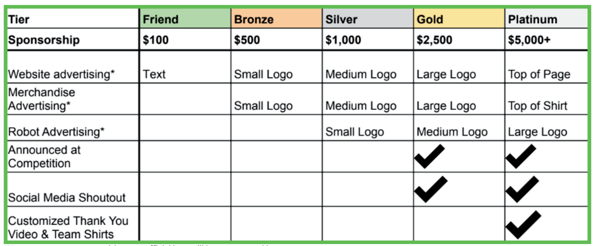
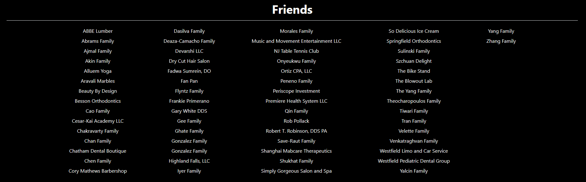
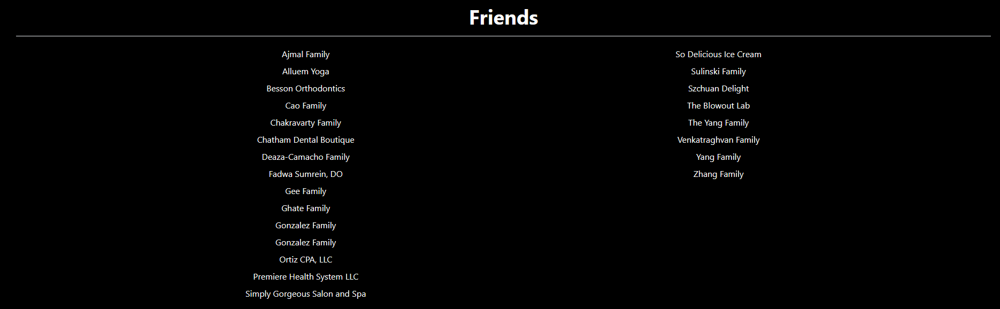
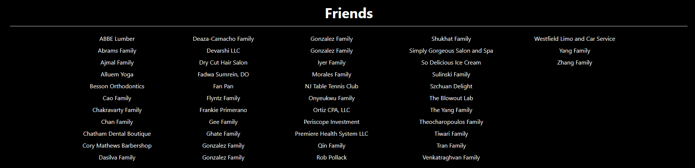

# Sponsors

After the fundraising deadline and all sponsor logos are collected, you should update the Sponsors page ASAP. For the 2024-2025 season, this was completed by the end of February.

This tutorial is based on the following sponsorship tier list:



# Tutorial

Locate `sponsorFriendTier.ts` in `pages/`. Simply replace whatever is there with a string array of the current year's Friend Tier sponsors. Do not get rid of the `.sort(..)` portion that alphabetizes the array.

Notice how with 60+ sponsors, the formatting looks pretty good:



However, with around 20, it looks a bit off:



To adjust this, locate `Sponsors.tsx` in `pages/` and look at this section:

```tsx
<div className="mt-2 mx-auto max-w-[96rem]">
    <ul className="flex flex-col lg:max-h-[30rem] lg:flex-wrap gap-2">
        {friends.map((friend) => (
        <li className="text-white text-center" key={friend}>{friend}</li>
        ))}
    </ul>
</div>
```

What we want to do is modify the maximum height of the Friend Tier section so that there will be more columns to spread the names across. We can achieve this by tweaking the value of `lg:max-h-[30rem]`. For example, for 40+ sponsors, a value of `23rem` works a little bit better:



Honestly though, just use your best judgment and ask your artistically-inclined friends for what value looks good.

Next, let's move on to Bronze Tier sponsors, which get a bit trickier.

Locate `src/assets/sponsors/bronze/` and replace whatever is inside with the current season's Bronze Tier sponsorship logos. While you're at it, you might as well do the same for `/silver/`, `/gold/`, and `/platinum/` as well.

Then locate `sponsorsBronze.ts` in `pages/`, which should look something like this:

```ts
import exothermic from "../assets/sponsors/bronze/Exothermic.png";
import grotto from "../assets/sponsors/bronze/Grotto Foundation.png";
import hvac from "../assets/sponsors/bronze/Jersey Strong Heating and Cooling.png";
import learning from "../assets/sponsors/bronze/Learning Beyond the Core.png";
import maita from "../assets/sponsors/bronze/Maita Roofing-Siding Windows-Gutters.png";
import truck from "../assets/sponsors/bronze/Port Truck Repair.png";
import dental from "../assets/sponsors/bronze/South Avenue Dental.png";
import bike from "../assets/sponsors/bronze/The Bike Stand.png";
import wright from "../assets/sponsors/bronze/Wright Family.png";
import wu from "../assets/sponsors/bronze/Wu IT Consulting.png";

const sponsorsBronze: string[] = [exothermic, grotto, hvac, learning, maita, truck, dental, bike, wright, wu];

export default sponsorsBronze;
```

Simply import each image from the current season's Bronze Tier logos instead using the path `../assets/sponsors/bronze/<logoname>.png`. The import variable names you use don't actually matter.

Then locate `Sponsors.tsx` in `pages/`. Let's take a look at the following snippet:

```tsx
<h1 className="text-white text-3xl font-bold text-center mb-2">Bronze Sponsors</h1>
<hr />
<div className="flex flex-row max-w-[72rem] flex-wrap justify-center mx-auto mb-5 gap-5">
    
    
    
    
    
    
    
    
    
    
</div>
```

You will likely have to change the number of `` tags depending on how many bronze sponsors there are. I find it easier to manually insert each image this way. Notice that some images have an added `bg-white` class added on. Add this on transparent logos with dark colors. 

Before we move on, let's take a look at a couple of lines at the beginning of the file:

```tsx
// using 18rem since max-w-[72rem] so 72/4 = 18
// but factor in gap-5 aka 1.25rem so about 16 is good
const BRONZE_SIZE: string = "w-[16rem] h-auto";
const SILVER_SIZE: string = "w-[22rem] h-auto";
```

What do these comments mean? Well, take a look at the Bronze Sponsors section again:

```html
<h1 className="text-white text-3xl font-bold text-center mb-2">Bronze Sponsors</h1>
<hr />
<div className="flex flex-row max-w-[72rem] flex-wrap justify-center mx-auto mb-5 gap-5"></div>
```

I set it so that the section would have a max width of `72rem`. Thus in order to have 4 columns of Bronze Tier logos, I needed `72/4 = 18rem` for each logo's size. I then factored in the `1.25rem` gap between logos, which I rounded down so that each logo was only `16rem` wide. The same thing applies for Silver Tier sponsors, except I wanted 3 columns (there were also only 3 sponsors in this tier). I needed `72/3 = 24rem` and `24-2 = 22rem`. Depending on the number of columns you want, you can tweak these values accordingly.

To update the Silver Tier logos, follow the same process as Bronze Tier. Just note that the file is called `sponsorsSilver.ts`. In the future, if there are more than 2 Gold or Platinum Tier sponsors, you can also do the same process of separating the image imports into a `sponsorsGold.ts` and `sponsorsPlat.ts` file. Otherwise, just import Gold and Platinum Tier sponsors directly into `Sponsors.tsx` as was done in the 2024-2025 season, where we only had one of each:

```tsx
import gold from "../assets/sponsors/gold/Handsome Energy Systems INC.png";
import plat from "../assets/sponsors/platinum/Picatinny STEM.png";

const Sponsors = () => {
  return (
    <div className="bg-black p-10">
      <h1 className="text-white text-3xl font-bold text-center mb-2">Platinum Sponsors</h1>
      <hr className="mb-5" />
      

      <h1 className="text-white text-3xl font-bold text-center mb-2">Gold Sponsors</h1>
      <hr className="mb-5" />
      

      {/* code below omitted */}
```

I found that for a single image, `w-[32rem]` worked best. Also, be sure to add in the `bg-white` if needed.
