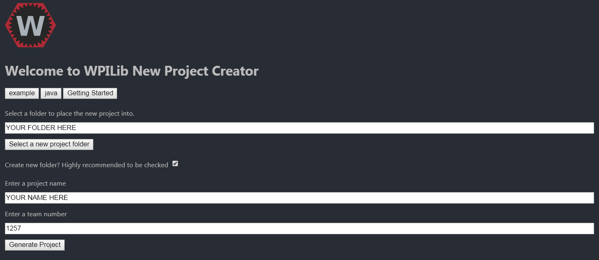

# Deploying Code

To make our code actually work, we have to have installed VSCode with the WPILib extension. Once this is done, you can go to the top right corner of VSCode, where you will see an icon for WPILib. Click that and make a new project.

Enter in the above settings and hit generate. In the bottom right, there should be a dialog to open the new project, hit yes.

Finally, you have a project you can work with. There should be some generated code in the source folder, you can edit that and replace it with your code. To build this code and check for errors, you can go to the WPILib menu again and hit `Build Robot Code`.

Once you are connected to a robot either through WiFi or tether, you can go to WPILib and then go to `Deploy Robot Code` to send the code to the robot. After this, congrats! You have pushed robot code!

To actually run your code, you need a program called `Driver Station`. This sadly isn't available for Mac OS as of now, so one needs a Windows computer to use it. Once `Driver Station` has been run, you can select the different robot modes to activate. However, always make sure that surroundings are clear before activating the robot, as anything could go wrong. If anything goes wrong, hitting `Space` will emergency stop the robot and prevent it from harming anyone.