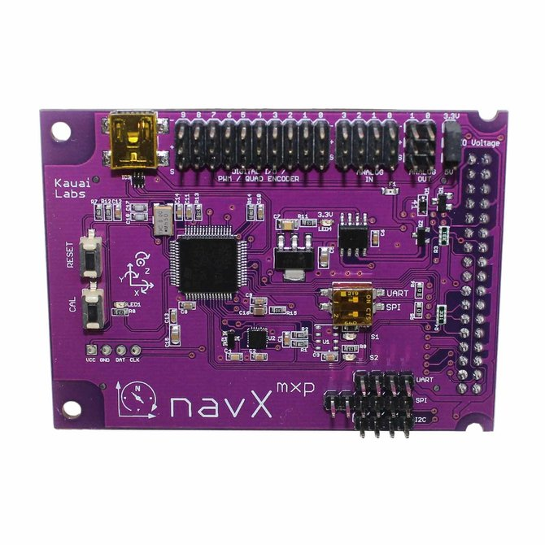
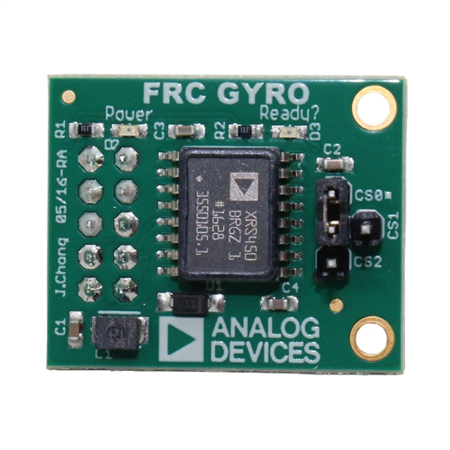

# Gyro

As we went over in the `Overview`, a gyroscope is a sensor that measures the angle of our robot relative to a set reference angle. For instance, if we start our robot while facing north, 90 deg corresponds to east and -90 deg corresponds to west. Generally, gyroscopes use the ranges -180 deg through 180 deg.

Typically on our robots, we actually include two gyroscopes. One is the NavX-MXP and the other is the ADXRS450. We do this because in the 2018 and 2019 seasons, we had issues where our NavX-MXP, our NavX for short, would become disconnected or even crash. As a result, we employed a system that would use the NavX while it was connected, and then used the readings from the ADXRS450 if the NavX was disconnected. We defaulted to using the NavX since it has much less drift than the ADXRS450 and is generally more accurate as the match progresses.

NavX



ADRXS450



In the 2018 season, we implemented this in the `util/Gyro.java` class, which creates the two sensors for us and then handles the logic to determine which sensor reading to use when asked. You can look at the class yourself and it should not be too complicated. The main tricky part is the **singleton** which we will discuss now.

## Singleton

A singleton is something known as a design pattern. It is used in classes which should only be instantiated **once** and only ever once. This way, we can avoid accidentally creating two gyroscope objects and having them potentially conflict with each other. This is especially important for sensors sometimes because creating two objects that refer to the same sensor can actually cause said sensor to crash.

The way we do this is by making the class have a `private` constructor instead of a `public` one. This prevents any other class from instantiating that class.

```java
private Gyro() {
    ...
}
```

Now that we've made it private, what we do is we need to make the one and the only instance of the `Gyro` class inside of the Gyro file. Then, we need to make that one instance accessible to the outside world. We can do this by adding the following function to our class:

```java
private Gyro instance = null;

public static Gyro getInstance() {
    if (instance != null) {
        instance = new Gyro();
    }

    return instance;
}
```

The reason we have the `if` statement and we initially assign `instance` to `null` is that we want to ensure that if the `Gyro` class is never used (which might be the case in some FRC games) that we don't unnecessarily create a `Gyro` object.

## Using the Gyro

Now that we know more about singleton, we can actually use the `Gyro` in other sections of our code. For instance, in our drivetrain, we want to access the `Gyro` and output the angle of our robot. We can do this as follows:

```java
public class Drivetrain extends SnailSubsystem {
    ...

    @Override
    public void displayShuffleboard() {
        SmartDashboard.putNumber("Robot Angle", Gyro.getInstance().getRobotAngle());
    }
}
```

We can also do the same for any of the other functions available in our `Gyro` class.

For reference:

- yaw = shaking head no
- pitch = shaking your head yes (like a pitcher going forward)
- roll = do a barrel roll direction (roll left or right)

When we refer to robot angle, we refer to yaw.
