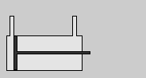
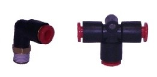
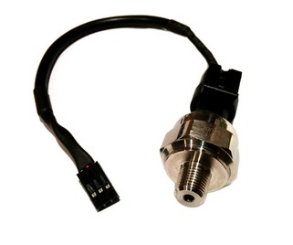
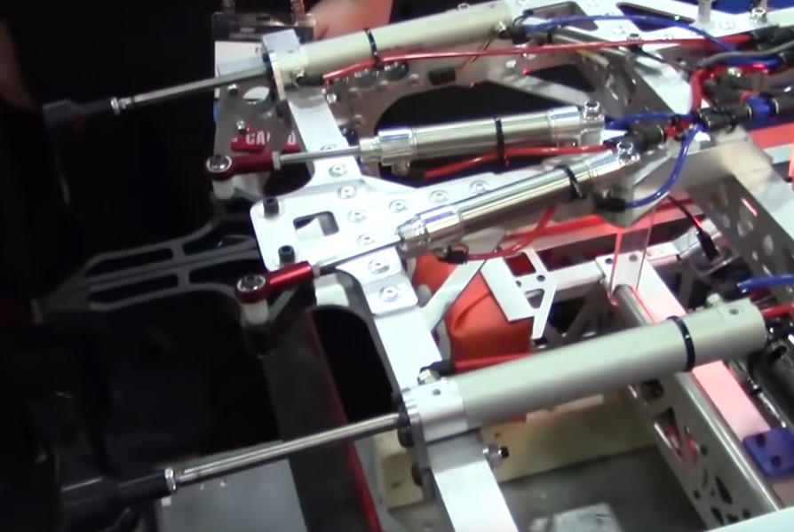
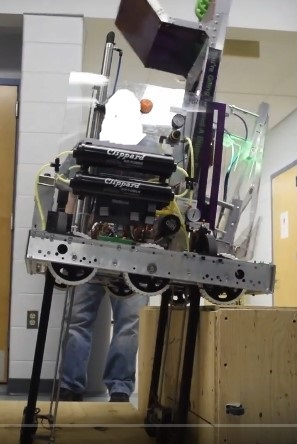

# Pneumatics

## Basics
Pneumatic components provide a strong complement to motors and gearboxes for various actuations. Once again, it is our job as programmers to convert the commands of the drive team into physical movement on the robot.

Reasons to use pneumatics over motors include simplicity, ruggedness, and consistent, fast actuations. However, a disadvantage would be the time it takes to compress air. Actuations will also either be all the way in, or all the way out -- this is a consequence of simplicity. This concept should be made more clear in the **Examples** section.

## Components

The following section consists of descriptions for the main elements of a basic FRC pneumatic system.

### Cylinders

 

Pneumatic cylinders are devices that use compressed gas to perform actuations with linear force -- basically, they can push (or even pull) things. For our purposes, there are two main types of cylinders: single-acting and double-acting.

 

(Source: https://en.wikipedia.org/wiki/Pneumatic_cylinder)

In a simple single-acting cylinder, the working fluid (air) acts only on one side of the piston. The cylinder will extend only when the pressurized air is put into it; once the pressure is released, a device such a spring will push the piston backwards, thus retracting the cylinder, as shown in the .gif on the left.

A double-acting cylinder works similarly to a single-acting one in that it requires air on one side to move the internal piston. In this type, however, the air can work alternately on both sides, therefore controlling both extension and retraction. In the .gif on the right, air retracts the cylinder instead of a spring.

### Solenoids

A solenoid is a device that essentially converts certain electrical signals into control of the air going into the cylinders. The types of solenoids include single and double: a single solenoid has a default position (e.g. cylinder retracted) that changes only when voltage is supplied (cylinded extended). When voltage is removed, the extended cylinder then retracts. Say that at the end of a match we have an intake mechanism with two single-acting cylinders extended while being connected to single solenoids. Once power is cut, the cylinders will return to their default positions. On the other hand, a double solenoid has two solenoids, and when we apply voltage to just one of them, the cylinder shifts in the corresponding direction. The double solenoid works like a light switch -- the solenoid will use power to go to one position, but will stay there until the opposite solenoid is powered, thus flipping the "switch."

1257 used *three-way, two-position* solenoids in their 2019 climb system. Along with the capabilities of a basic double solenoid, this device allows air to act on both sides/directions simultaneously, such that the cylinder can be "frozen" in a position.

### Compressor

There's not much to say in this section -- an air compressor gathers the pressurized air needed to power our pneumatic actuations. It is controlled by a pressure switch that tells it to automatically shut-off at certain point in order to conserve battery power.

### PCM

The *Pneumatic Control Module* is an electronic interface used to control the compressor, solenoid(s), and pressure switch once it is wired up to the RoboRIO correctly. It can control eight single solenoid valves or four double solenoid valves.

### Fittings, Controls, Air Tanks, & Sensors

   

We've gone over the fundamental components, but there are still some essential pieces to the system: fittings, flow controls, and sensors. On the left are two examples of fittings: these are used to connecting tubing together for transfer of air. Next, in the center, are flow controls. This is attached directly onto the pneumatic cylinder and regulates the flow of air in and out of it (speeds up/slows down airflow). Air tanks are also required so that the pressurized air can be stored. Finally, we have the pressure sensor that acts as an indicator for the amount of pressure. For our purposes, there are usually two sensors set to two different thresholds; if the pressure is below a certain point, turn the compressor on, and if the pressure is above a certain point, turn the compressor off.

## Examples 

(Source: https://www.youtube.com/watch?v=JlKwRAvDue8)

As mentioned above, pneumatic mechanisms are great for linear motion that maintain constant force. A prime example of this would be Team 2056's (OP Robotics) 2019 hatch panel intake, as pictured above. The intake utilizes four pneumatic cylinders that enable quick pickup and placing of hatches. Two cylinders control the beak in front. These two stay extended so that the beak can be placed inside a hatch, and then they are retracted in order to open up the beak and hold the hatch. The whole process is undone to place a disc: the beak-cylinders are extended, which frees the panel, and then the two larger cylinders on the side are extended to push the panel onto the target. Now, this mechanism is an example of how actuations can only be "fully in" or "fully out." The beak cannot be opened midway, opened at certain speed, etc. Overall, though, 2056's intake is a very efficient usage of pneumatic cylinders that allows for consistent actuations.

  

(Source: https://www.youtube.com/watch?v=odiJaZKE0xs)

Another example of a pneumatic mechanism would be Team 1257's 2019 climb system. It utilizes four long pneumatic cylinders that extend with enough strength to raise the entire robot up sufficiently. After driving the head of the robot onto the platform, the front cylinders are retracted and the robot drives forward more. All that's left is to retract the back cylinders and inch forward even more. We have climbed! 

You may thinking, "Wow, this sounds too good to be true; the robot can climb that smoothly?" Well yes, but actually, no. 1257's 2019 robot climb was not very balanced, and therefore required stabilization. Using a gyroscope to measure the yaw angle in tandem with the three-way, two-position solenoids, the robot could freeze the correct cylinders in order to stop itself from falling over.

