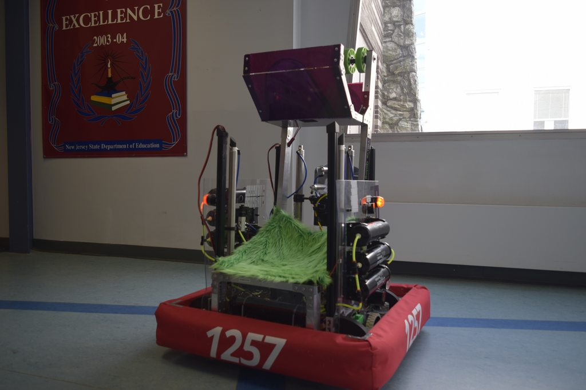

# Arm 

A commonly-used subsystem is an arm. Let's take 1257's 2019 full intake arm and go through an example command-based program with it.

 

On this robot, the arm is a mechanism that moves in a space of ~90 degrees, allowing for some degree of freedom. It allows for ground pickup and ejection of the cargo in various places. The arm is hooked up to one motor going through a gearbox on the robot, enabling the driver to control the arm manually.

Hence, we have *one possible state already: manual control*. One could also use a control loop to move the arm towards precise positions, but we'll skip over that in this section, however. (See the [Higher Topics section](https://github.com/FRC1257/robotics-training/tree/master/frc/4.%20Higher%20Topics/PID) for more information.) 

We will structure the program here as if we had multiple states, but will only include the `MANUAL` state for now.

## The Subsystem

```java
package frc.robot.subsystems;

import static frc.robot.Constants.*;

import com.ctre.phoenix.motorcontrol.can.WPI_VictorSRX;
import edu.wpi.first.wpilibj2.command.SubsystemBase;

public class IntakeArm extends SubsystemBase {

    private WPI_VictorSPX armMotor;
    private double armSpeed;

    public enum State {
        MANUAL
    }
    private State state = State.MANUAL;

    public IntakeArm() {
        armMotor = new WPI_VictorSPX(ARM_MOTOR_ID);
        
    }

}
```

So far, we've created our subsystem, declared our speed variable and `WPI_VictorSPX` motor, and set up our enum state. 

The next step would be to add a method that can manipulate the enum state. We also will use `periodic()` to read the state and update our motor, and include a separate method named `setArmSpeed()` as a public setter of `armSpeed`.

```java
package frc.robot.subsystems;

import static frc.robot.Constants.*;

import com.ctre.phoenix.motorcontrol.can.WPI_VictorSRX;
import edu.wpi.first.wpilibj2.command.SubsystemBase;

public class IntakeArm extends SubsystemBase {

    private WPI_VictorSPX armMotor;
    private double armSpeed;

    public enum State {
        MANUAL
        // could add more states here
    }
    private State state = State.MANUAL;

    public IntakeArm() {
        armMotor = new WPI_VictorSPX(ARM_MOTOR_ID);
    }

    @Override
    public void periodic() {
        switch(state) {
            case MANUAL: 
                armMotor.set(armSpeed);
                break;
        }
    
        armSpeed = 0;
    }

    public void setArmSpeed(double armSpeed) {
        this.armSpeed = armSpeed;
    }
}
```

Similar to the roller intake subsystem, the `periodic()` method uses a switch statement to check for potential states and manipulate the cargo arm accordingly. Observe once again how the final action is performed within `periodic()` and not in `setArmSpeed()`. Instead, we have `setArmSpeed()` take in an input and assign it to the final motor output variable, `speed`. Finally, we set `speed` to zero in order to reset it at the end of each loop.  

Note that we have the line `armSpeed = 0;` in `periodic()` after the switch statement. This is simply a precaution to reset the arm speed in case of a mechanical malfunction that occurs while `periodic()` is looping. This reset will not affect the control capability, as the `armSpeed` will be updated anyway.

Once again, this subsystem structure with the enum state, switch statement, and public setter methods allows for smooth expansion in the future (i.e. adding other states to manipulate `speed` differently). It also provides a simple path for commands to interface with the subsystem and do their work.

## The Command(s)

Now it's time to make our arm's commands. For now, we'll only have one, named `ManualCommand`.

```java
package frc.robot.commands.arm;

import edu.wpi.first.wpilibj.XboxController;
import edu.wpi.first.wpilibj.GenericHID.Hand;
import edu.wpi.first.wpilibj2.command.CommandBase;
import frc.robot.subsystems.IntakeArm;

public class ManualCommand extends CommandBase {

    private final IntakeArm intakeArm;
    private final XboxController controller;

    public ManualCommand(IntakeArm intakeArm, XboxController controller) {
        this.intakeArm = intakeArm;
        this.controller = controller;
        
        addRequirements(intakeArm);
    }

    @Override
    public void initialize() {

    }

    @Override
    public void execute() {
        intakeArm.setArmSpeed(controller.getY(Hand.kRight));
    }

    @Override
    public void end(boolean interrupted) {

    }

    @Override
    public boolean isFinished() {
        return false;
    }
}
```

So, we've done a few things here:

- We set up an `intakeArm` variable, passed in the parameter, and set it as a command requirement. 
- We also set up an independent `controller` variable and passed in the parameter. This allows us to reference its stick/button values in the future.
- For the command's execution, we referenced the `setArmSpeed()` method and passed in `controller.getY(Hand.kRight)`, which returns the right-side joystick's y-axis value as an input.
- The controller's joystick's input is sent through `setArmSpeed()` and into the subsystem's `periodic()`, moving the arm as a result.

## Binding 

Alright, so we've programmed both the subsystem and its command. The next step would be to bind the command to the controller -- however, we don't have to do that in this case. Instead, we can call this comand as a default command in `RobotContainer`. 

```java
package frc.robot;

import static frc.robot.Constants.*; 

import edu.wpi.first.wpilibj.XboxController;
import edu.wpi.first.wpilibj.XboxController.Button;
import edu.wpi.first.wpilibj2.command.button.JoystickButton;
import frc.robot.commands.arm.ManualCommand;
import frc.robot.subsystems.IntakeArm;

public class RobotContainer {

    private final IntakeArm intakeArm;

    private final XboxController controller;

    public RobotContainer() {
        controller = new XboxController(CONTROLLER_ID);

        intakeArm = new IntakeArm();
        intakeArm.setDefaultCommand(new ManualCommand(intakeArm, controller));
        
        configureButtonBindings();
    }

    private void configureButtonBindings() {
        // here, we would add bindings for commands other than
        // the default command (in the case of this subsystem)
    }
}
```
Now, the arm will always look for controller input, unless a specially controlled-state is set up. Of course, we would accordingly reference `RobotContainer` in `Robot.java` so that the command would run correctly. 

And we're finished! Full code can be found in the `/programs/` folder.