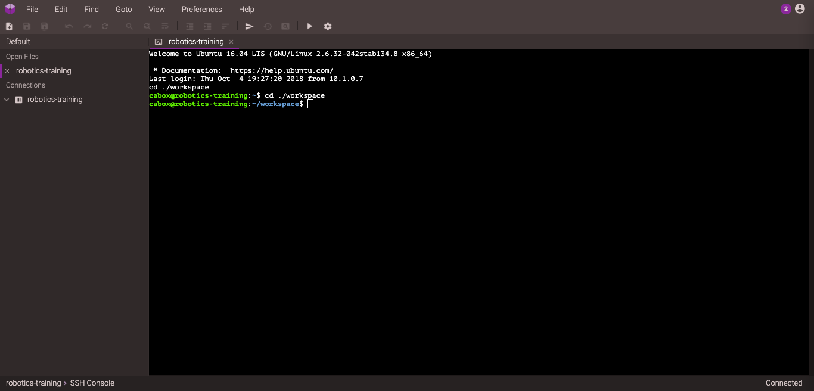

# Programming Subteam

## Programming Language
This year, we will be using Java to write our robot code. In the past, we have used C++ but we have made the decision to use Java.

* Reference - https://www.tutorialspoint.com/java/java_basic_datatypes.htm
* https://introcs.cs.princeton.edu/java/home/
* More Advanced Reference - https://docs.oracle.com/javase/tutorial/java/index.html
* Exercises - http://programmingbydoing.com/
* Cheatsheet: https://introcs.cs.princeton.edu/java/11cheatsheet/

## IDEs
Java programs are usually written in an IDE, or Integrated Development Environment. For robot programming, we'll be using [Visual Studio Code](https://code.visualstudio.com/). However, we cannot install IDEs on Chromebooks, so for now, we will be using an online cloud based IDE called codeanywhere.com.

## codeanywhere.com

Go to [codeanywhere.com](https://codeanywhere.com/). Scroll to the very bottom and select `Sign Up` (or just go to this link: [Sign Up](https://codeanywhere.com/signup)). Don't hit `Sign Up` in the top right, this will bring you to the pricing page. Enter in your details, and then go to your email to verify your account. Once you do this, you can press `Editor`, or just go to [Editor](https://codeanywhere.com/editor/). When prompted for the type of project, select `Java - Ubuntu 16.04`, or whatever version of Ubuntu they are on. For name, you can put anything you like. I put `robotics-training`. It might take a while, but eventually the container will be created.

Close the initial tab, and you will be greeted with the below screen.

In the center, you will have the terminal. We will learn how to use this later. Take a look at  `git/Git Reference/md` and the `Terminal Commands` section for some basic commands. On the left, you will have the file explorer, and you can click the arrow to the left of `robotics-training` to expand the folder and see what is inside. For now, there should be nothing in it. You can also right click `robotics-training` to create new files and programs, but we will go over this in the Java tutorials.

## Why We Use Java

* Many other teams use Java, giving us more reference material
* In general, people have stated that Java is easier to learn

## Curriculum

Don't worry if you have no clue what these things are, we will go over all of them and try our best to teach you them. Anything with a star (*) next to it is essential and you should expect to see frequently in robotics programming. Anything without a star is still good to know, but you will make it by without knowing those.

* Basics (1 day)
  * First Program *
  * Variables *
  * Operators *
  * Comments *
* Control-Flow (1 day)
  * If/Else Statements *
  * Logical Operators *
  * Switch Statements *
  * While Loops
  * For Loops
  * Enums *
* Arrays (1 day)
  * Arrays
  * Looping through Arrays
* Functions (2 days)
  * Basic Functions *
  * Functions w/ Arguments *
  * Functions w/ Return Types *
  * Overloading
* Objects (2 days)
  * Objects *
  * Classes *
  * Inheritance *
  * Overriding *
  * Polymorphism

Once we finish these topics, we will go onto robotics programming. This should hopefully start by around mid-November.

## What You Should Do

We all have a ton of schoolwork. However, to get good at programming, you will want to spent at least 10 minutes each day familiarizing youself with the language and trying out random things. Just coming to robotics twice a week won't make you a great programmer, but practice will.

## Help

If you need help, don't feel shy to ask a senior member or the captain about any programming questions. It is difficult to learn programming in under a few months, so don't feel bad about any difficulties you are having. Good luck!

## Typos

If you find any mistakes, tell me or even better, after we learn Git, make an issue and/or pull request on Github to notify me of the problem. 
